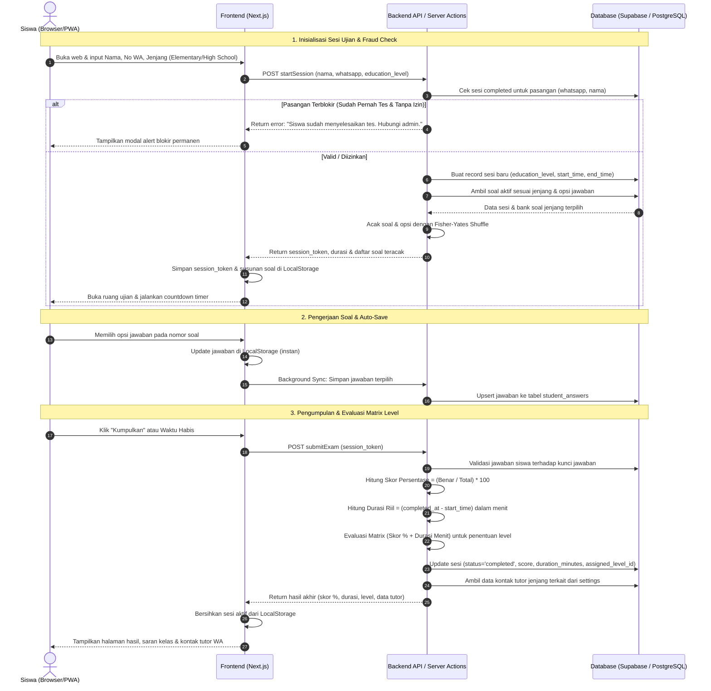
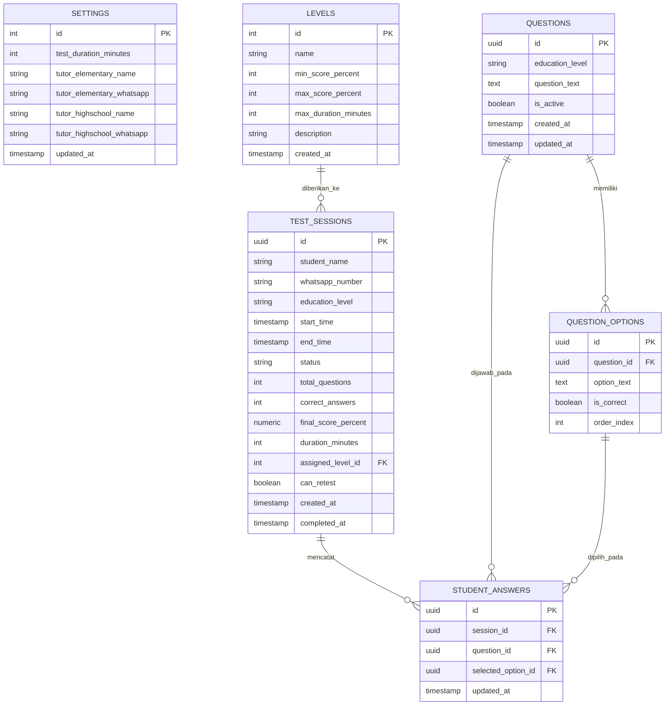

# Product Requirements Document (PRD)
## Up Speaking Placement Test System

---

## 1. Overview

**Up Speaking Learning Centre** adalah lembaga kursus bahasa Inggris yang menerima calon siswa dari berbagai jenjang usia (pelajar sekolah hingga masyarakat umum). Saat ini, penentuan level awal calon siswa (*placement test*) masih dilakukan secara manual, mulai dari pembagian lembar soal fisik, pengawasan, hingga penghitungan nilai dan pengelompokan kelas belajar. Proses manual ini memakan waktu staf, rawan kesalahan perhitungan skor, dan memperlambat alur pendaftaran.

Aplikasi **Up Speaking Placement Test System** dibangun sebagai solusi berbasis web (*Progressive Web App / PWA*) yang dirancang khusus untuk mengotomatisasi seluruh alur tes penempatan. Sistem ini memfasilitasi calon siswa untuk mengerjakan tes secara mandiri sesuai jenjang pendidikannya tanpa perlu membuat akun berbelit, sekaligus memberikan dashboard terpusat bagi admin lembaga untuk mengelola bank soal per jenjang, memantau rekap hasil secara *real-time*, dan mengarahkan siswa ke tutor pembimbing masing-masing.

Tujuan utama sistem ini adalah menghadirkan proses pendaftaran yang cepat, efisien, dan bebas hambatan (*zero friction*) bagi calon siswa, serta menyajikan kalkulasi nilai berbasis **matrix skor dan efisiensi waktu pengerjaan** secara otomatis, konsisten, dan terstruktur bagi manajemen Up Speaking.

---

## 2. Requirements

* **Aksesibilitas Platform:**
  * Berbasis *Progressive Web App (PWA)* yang sepenuhnya responsif di layar ponsel pintar (*smartphone*), tablet, dan laptop/desktop.
  * Dapat diakses langsung melalui peramban (*web browser*) tanpa kewajiban mengunduh aplikasi dari app store.
* **Tipe Pengguna & Hak Akses:**
  * **Siswa (Peserta):** Akses publik tanpa akun/password; memilih jenjang pendidikan serta mengisi formulir identitas awal (*Nama Lengkap*, *Nomor WhatsApp*, dan *Jenjang: Elementary / High School*).
  * **Admin (Staf/Tutor Lembaga):** Memerlukan autentikasi akun (*Email & Password*) untuk mengakses dashboard manajemen.
* **Mekanisme Pengerjaan & Integritas Data:**
  * Seluruh butir soal aktif sesuai jenjang pendidikan yang dipilih akan diujikan kepada siswa.
  * Setiap siswa mendapatkan urutan soal dan urutan opsi pilihan ganda yang diacak secara otomatis menggunakan algoritma **Fisher-Yates Shuffle**.
  * Mekanisme *Auto-save*: Jawaban otomatis disimpan ke *Local Storage* dan server latar belakang setiap kali dipilih.
  * Ketahanan Sesi (*Crash Recovery*): Jika browser tidak sengaja tertutup atau perangkat mati, siswa dapat membuka kembali halaman web dan melanjutkan pengerjaan selama batas waktu tes server belum berakhir.
  * **Pencegahan Fraud & Batasan Sesi Permanen:**
    * Kunci identitas unik sesi tes diikat pada pasangan **`Nomor WhatsApp + Nama Lengkap Siswa`**. Hal ini memungkinkan orang tua menggunakan satu nomor WhatsApp untuk mendaftarkan lebih dari satu anak (misal: kakak dan adik).
    * Setiap pasangan `Nomor WhatsApp + Nama Siswa` yang telah menyelesaikan tes (`completed`) akan **dikunci secara permanen**. Upaya tes ulang berikutnya akan diblokir oleh sistem, kecuali Admin memberikan izin tes ulang (*Retest Permission*) melalui dashboard.
* **Batasan & Non-Fungsional:**
  * Tidak menggunakan mekanisme pengawasan berlebih (*anti-cheat overengineering*), karena placement test ditujukan untuk memetakan kemampuan riil siswa.
  * Menggunakan jam server (*server timestamp*) untuk mengontrol batas akhir ujian (*end time*), sehingga sisa waktu tidak dapat dimanipulasi dengan menutup browser.

---

## 3. Core Features

### 1. Landing Page & Registrasi Peserta (*Quick Entry*)
* Halaman pembuka (*Landing Page*) resmi yang memuat profil tes, petunjuk ringkas, dan tombol CTA utama.
* Form pendaftaran minimalis (muncul via Modal Pop-up / Bottom Sheet saat tombol CTA ditekan) dengan 3 input:
  1. **Nama Lengkap Siswa**
  2. **Nomor WhatsApp**
  3. **Jenjang Pendidikan:** Pilihan antara `Elementary (SD)` atau `High School (SMP / SMA / Umum)`.
* Pembentukan token sesi unik (*Session Token*) otomatis di server dan tersimpan di *Local Storage* browser siswa.
* **Pemulihan Sesi Otomatis (Anti-Close):** 
  * Jika browser tidak sengaja tertutup, saat siswa membuka web kembali, sistem langsung otomatis membawanya kembali ke halaman soal dengan sisa waktu dan jawaban yang aman.
  * Sebagai cadangan (jika cache browser terhapus), siswa cukup memasukkan Nomor WhatsApp dan Nama Lengkap yang sama di form pendaftaran, dan sistem akan langsung mengembalikan siswa ke sesi ujian yang sedang berjalan.

### 2. Ruang Ujian Pilihan Ganda (*Exam Room*)
* Menampilkan seluruh soal aktif dari bank soal yang sesuai dengan jenjang pendidikan siswa (`Elementary` atau `High School`).
* **Pengacakan Urutan Soal:** Urutan kemunculan soal berbeda untuk setiap sesi siswa (Fisher-Yates).
* **Pengacakan Opsi Jawaban:** Posisi pilihan jawaban (A, B, C, D, dst.) diacak secara dinamis per soal (Fisher-Yates).
* **Sinkronisasi Waktu (*Countdown Timer*):** Menampilkan sisa waktu pengerjaan yang terikat pada jam selesai server.
* **Pencatatan Durasi Pengerjaan:** Sistem menghitung durasi waktu riil yang dihabiskan siswa (`submitted_at - started_at` dalam satuan menit).
* **Auto-Save Jawaban:** Menyimpan jawaban terpilih secara instan tanpa perlu tombol simpan manual.
* **Navigasi Soal:** Palet nomor soal interaktif dengan penanda status soal (sudah dijawab / belum dijawab).
* **Konfirmasi Pengumpulan:** Modal konfirmasi sebelum submit akhir atau otomatis terkumpul ketika waktu habis.

### 3. Penilaian Berbasis Matrix Skor & Waktu Pengerjaan
* **Skoring Berbasis Persentase:** 
  * Rumus: `Skor (%) = (Jumlah Jawaban Benar / Total Soal) * 100`
* **Matrix Penentuan Level Otomatis (Skor + Durasi Waktu):**
  Penentuan level mengukur kombinasi kebenaran jawaban dan efisiensi waktu pengerjaan:

  | Level Penempatan | Kriteria Nilai Skor (%) | Kriteria Durasi Pengerjaan | Keterangan Evaluasi |
  |---|---|---|---|
  | **Advanced** | 80% – 100% | Maksimal 25 menit (<= 25 menit) | Akurasi tinggi dan pengerjaan cepat |
  | **Intermediate** | 60% – 79% | Maksimal 20 menit (<= 20 menit) | Standar kemampuan menengah |
  | | 80% – 100% | Lebih dari 25 menit (> 25 menit) | Turun level dari Advanced karena waktu pengerjaan lambat |
  | **Beginner** | 0% – 59% | Berapa pun durasinya | Fondasi dasar bahasa Inggris |
  | | 60% – 79% | Lebih dari 20 menit (> 20 menit) | Turun level dari Intermediate karena waktu pengerjaan lambat |
* **Halaman Hasil Siswa:**
  * Menampilkan skor persentase, rincian benar/total, durasi pengerjaan riil, dan badge level yang diraih.
  * Menampilkan kartu rekomendasi kelas sesuai Jenjang + Level (contoh: *Elementary - Intermediate* atau *High School - Advanced*).
  * **Kontak Tutor Penanggung Jawab:** Menampilkan nama tutor penanggung jawab jenjang bersangkutan beserta tombol direct WhatsApp untuk konsultasi jadwal dan pendaftaran kelas les.

### 4. Admin Management Dashboard
* **Autentikasi Admin:** Halaman login aman khusus staf lembaga.
* **Manajemen Bank Soal (CRUD):** 
  * Tambah, lihat, ubah, dan hapus soal dengan penanda **Jenjang Pendidikan** (`Elementary` / `High School`).
  * Pilihan jawaban dinamis (default 4 opsi A–D, dapat ditambah hingga opsi E atau dikurangi min. 2 opsi) serta penentuan kunci jawaban yang benar.
* **Pengaturan Ujian (Settings):**
  * Konfigurasi batas durasi waktu pengerjaan tes utama (dalam menit).
  * Pengaturan rentang persentase kelulusan dan batas waktu matrix untuk 3 level penempatan.
  * Pengaturan data kontak Tutor Penanggung Jawab per jenjang:
    * Tutor Elementary (Nama & Nomor WhatsApp).
    * Tutor High School (Nama & Nomor WhatsApp).
* **Rekapitulasi Hasil Siswa:**
  * Tabel riwayat pengerjaan tes: Nama Siswa, No. WhatsApp, Jenjang, Waktu Tes, Durasi Pengerjaan, Benar/Total, Skor %, dan Level.
  * Filter data berdasarkan Level dan Jenjang Pendidikan.
  * Pencarian data berdasarkan nama atau nomor WhatsApp.
  * Fitur unduh/ekspor data rekapitulasi ke format **PDF / Excel** (otomatis menyesuaikan filter yang aktif).
  * **Fitur Izin Tes Ulang (*Retest Permission*):** Tombol aksi untuk memberikan izin 1x tes ulang bagi pasangan Nomor WhatsApp dan Nama Siswa yang sebelumnya terblokir permanen, tanpa menghapus riwayat nilai lamanya.

---

## 4. User Flow

### A. Alur Siswa (Peserta Tes)
1. Siswa membuka tautan web Up Speaking melalui smartphone atau laptop.
2. Sistem mengecek status sesi aktif:
   * *Jika ada sesi aktif yang belum kadaluarsa:* Siswa langsung diarahkan ke Ruang Ujian dengan melanjutkan sisa waktu dan jawaban sebelumnya.
   * *Jika tidak ada sesi:* Ditampilkan halaman awal berisi instruksi tes dan form identitas.
3. Siswa mengisi **Nama Lengkap**, **Nomor WhatsApp**, dan memilih **Jenjang Pendidikan** (`Elementary` / `High School`), lalu menekan tombol **"Mulai Mengerjakan"**.
4. Sistem memverifikasi fraud check (memastikan siswa dengan nama & nomor WA tersebut belum pernah menyelesaikan tes).
5. Sistem menginisialisasi sesi di server, mengambil soal aktif yang sesuai jenjang pendidikan (diacak dengan Fisher-Yates), dan membuka halaman ujian dengan timer berjalan.
6. Siswa memilih jawaban untuk setiap soal. Setiap klik jawaban otomatis tersimpan ke *Local Storage* dan server.
7. Siswa mengklik tombol **"Kumpulkan Ujian"** (atau menunggu hingga waktu habis).
8. Sistem mengunci sesi, mencatat durasi waktu selesai, menghitung skor %, mengevaluasi matrix level (skor + waktu), dan memperbarui status sesi menjadi `completed`.
9. Layar siswa menampilkan kartu hasil berisi skor persentase, durasi pengerjaan, lencana level, rekomendasi kelas, dan kontak tutor jenjang yang siap dihubungi via WhatsApp.

### B. Alur Admin (Staf Lembaga)
1. Admin mengakses rute `/admin` dan memasukkan email serta password.
2. Masuk ke halaman **Dashboard Utama**:
   * Melihat ringkasan metrik (total siswa tes, distribusi level, pembagian jenjang).
   * Membuka menu **Bank Soal** untuk mengelola pertanyaan per jenjang (`Elementary` / `High School`).
   * Membuka menu **Pengaturan** untuk menyesuaikan durasi tes, matrix level, dan kontak tutor penanggung jawab jenjang.
   * Membuka menu **Laporan Hasil** untuk menyaring riwayat pengerjaan siswa, memberikan izin tes ulang (*Retest Permission*), dan mengunduh rekapitulasi data.

---

## 5. Architecture

---

## 6. Database Schema

### A. Entity Relationship Diagram (ERD)

### B. Deskripsi Tabel

| Nama Tabel | Deskripsi Fungsi |
| :--- | :--- |
| `settings` | Menyimpan konfigurasi umum tes: durasi waktu pengerjaan (menit) serta kontak tutor penanggung jawab per jenjang (Elementary & High School). |
| `levels` | Menyimpan master data 3 level penempatan (nama, rentang skor % minimal-maksimal, batas waktu pengerjaan menit, dan deskripsi kelas). |
| `questions` | Menyimpan butir soal placement test, dilengkapi kolom `education_level` (`elementary` / `high_school`) dan status aktif. |
| `question_options` | Menyimpan daftar pilihan jawaban per soal beserta penanda kunci jawaban yang benar (`is_correct`). |
| `test_sessions` | Menyimpan data identitas siswa, nomor WhatsApp, jenjang pendidikan, waktu mulai & selesai, durasi pengerjaan riil, skor %, level yang diraih, serta flag izin tes ulang (`can_retest`). |
| `student_answers` | Menyimpan rekaman riwayat jawaban yang dipilih siswa secara otomatis (*auto-save*) untuk setiap butir soal. |

---

## 7. Design & Technical Constraints

* **Frontend & Backend Framework:** **Next.js (React)** dengan App Router, React Server Components, dan Server Actions.
* **Styling & Komponen UI:** **Tailwind CSS**, dengan kebebasan penuh perancangan visual estetis dan responsif untuk mobile dan desktop.
* **Progressive Web App (PWA):** Dilengkapi dengan *web app manifest* dan ikon PWA agar aplikasi dapat diinstal di homescreen ponsel tanpa melalui Play Store.
* **Database & Autentikasi:** **Supabase (PostgreSQL)** untuk basis data relasional serta autentikasi staf Admin.
* **Manajemen State Lokal:** **Browser Local Storage** digunakan untuk ketahanan sesi pengerjaan (*crash recovery*) dan auto-save jawaban.

---

## 8. Skema Penilaian Default & Seeder Awal

### Matrix Level Bawaan:
1. **Level 1 (Beginner):**
   - Skor: **0% – 59%** (durasi berapa pun), ATAU skor **60% – 79%** dengan durasi pengerjaan **lebih dari 20 menit (> 20 menit)**.
   - Deskripsi: *Penguatan fondasi dasar kosakata, pelafalan, dan struktur kalimat sederhana.*
2. **Level 2 (Intermediate):**
   - Skor: **60% – 79%** dengan durasi pengerjaan **maksimal 20 menit (<= 20 menit)**, ATAU skor **80% – 100%** dengan durasi **lebih dari 25 menit (> 25 menit)**.
   - Deskripsi: *Pemantapan kelancaran percakapan, pemahaman tata bahasa menengah, dan kecepatan merespons.*
3. **Level 3 (Advanced):**
   - Skor: **80% – 100%** dengan durasi pengerjaan **maksimal 25 menit (<= 25 menit)**.
   - Deskripsi: *Tingkat mahir: penguasaan percakapan kompleks, pemikiran kritis berbahasa Inggris, dan respons instan.*
