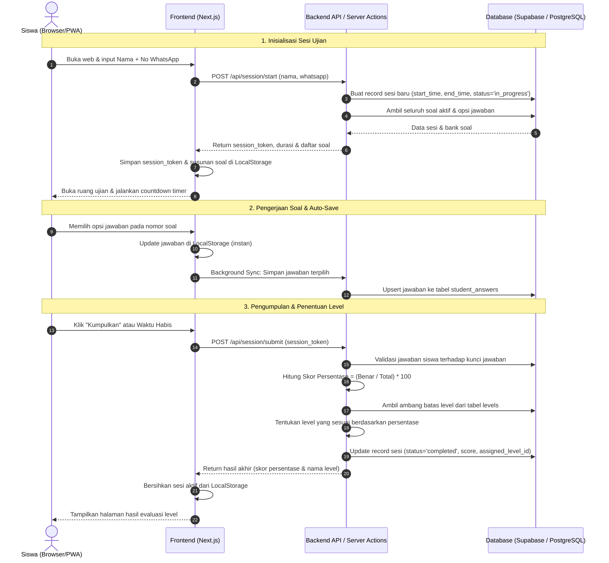
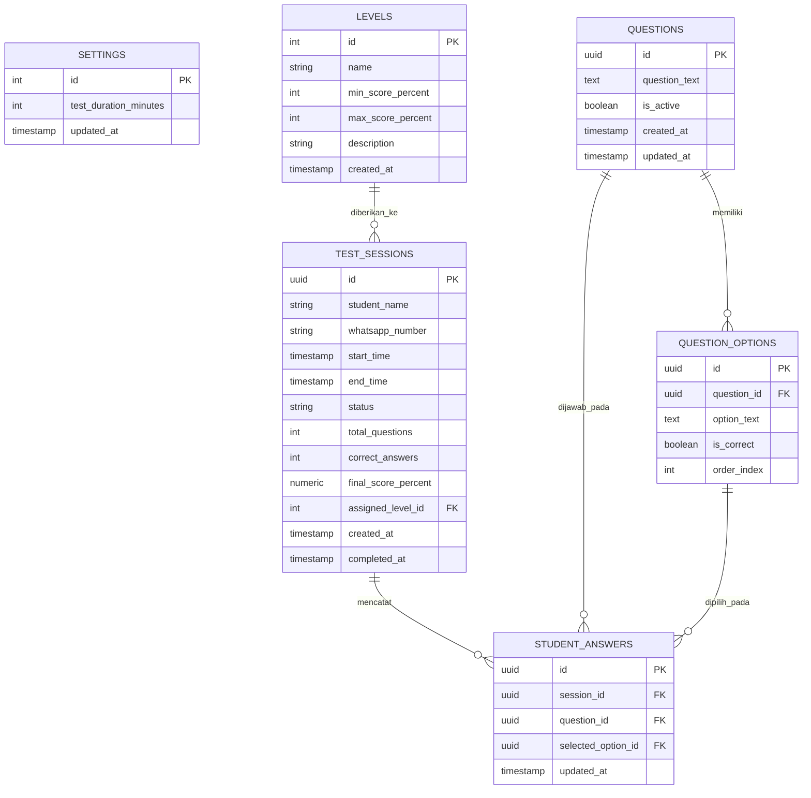

# Product Requirements Document (PRD)
## Up Speaking Placement Test System

---

## 1. Overview

**Up Speaking Learning Centre** adalah lembaga kursus bahasa Inggris yang menerima calon siswa dari berbagai jenjang usia (pelajar sekolah hingga masyarakat umum). Saat ini, penentuan level awal calon siswa (*placement test*) masih dilakukan secara manual, mulai dari pembagian lembar soal fisik, pengawasan, hingga penghitungan nilai dan pengelompokan kelas belajar. Proses manual ini memakan waktu staf, rawan kesalahan perhitungan skor, dan memperlambat alur pendaftaran.

Aplikasi **Up Speaking Placement Test System** dibangun sebagai solusi berbasis web (*Progressive Web App / PWA*) yang dirancang khusus untuk mengotomatisasi seluruh alur tes penempatan. Sistem ini memfasilitasi calon siswa untuk mengerjakan tes secara mandiri tanpa perlu membuat akun berbelit, sekaligus memberikan dashboard terpusat bagi admin lembaga untuk mengelola soal dan memantau rekap hasil secara *real-time*.

Tujuan utama sistem ini adalah menghadirkan proses pendaftaran yang cepat, efisien, dan bebas hambatan (*zero friction*) bagi calon siswa, serta menyajikan kalkulasi nilai dan penentuan level belajar secara otomatis, konsisten, dan terstruktur bagi manajemen Up Speaking.

---

## 2. Requirements

* **Aksesibilitas Platform:**
  * Berbasis *Progressive Web App (PWA)* yang sepenuhnya responsif di layar ponsel pintar (*smartphone*), tablet, dan laptop/desktop.
  * Dapat diakses langsung melalui peramban (*web browser*) tanpa kewajiban mengunduh aplikasi dari app store.
* **Tipe Pengguna & Hak Akses:**
  * **Siswa (Peserta):** Akses publik tanpa akun/password; hanya mengisi formulir identitas awal (*Nama Lengkap* & *Nomor WhatsApp*).
  * **Admin (Staf/Tutor Lembaga):** Memerlukan autentikasi akun (*Email & Password*) untuk mengakses dashboard manajemen.
* **Mekanisme Pengerjaan & Integritas Data:**
  * Seluruh soal aktif yang ada di bank soal akan diujikan kepada siswa.
  * Setiap siswa mendapatkan urutan soal dan urutan opsi pilihan ganda yang diacak secara otomatis.
  * Mekanisme *Auto-save*: Jawaban otomatis disimpan ke *Local Storage* dan server latar belakang setiap kali dipilih.
  * Ketahanan Sesi (*Crash Recovery*): Jika browser tidak sengaja tertutup atau perangkat mati, siswa dapat membuka kembali halaman web dan melanjutkan pengerjaan selama batas waktu tes server belum berakhir.
* **Batasan & Non-Fungsional:**
  * Tidak menggunakan mekanisme pengawasan berlebih (*anti-cheat overengineering*), karena placement test ditujukan untuk memetakan kemampuan riil siswa.
  * Menggunakan jam server (*server timestamp*) untuk mengontrol batas akhir ujian (*end time*), sehingga sisa waktu tidak dapat dimanipulasi dengan menutup browser.

---

## 3. Core Features

### 1. Landing Page & Registrasi Peserta (*Quick Entry*)
* Halaman pembuka (*Landing Page*) resmi yang memuat profil tes, petunjuk ringkas, dan tombol CTA utama.
* Form pendaftaran minimalis (muncul via Modal Pop-up / Bottom Sheet saat tombol CTA ditekan) hanya dengan 2 input: **Nama Lengkap** dan **Nomor WhatsApp**.
* Pembentukan token sesi unik (*Session Token*) otomatis di server dan tersimpan di *Local Storage* browser siswa.
* **Pemulihan Sesi Otomatis (Anti-Close):** 
  * Jika browser tidak sengaja tertutup, saat siswa membuka web kembali, sistem langsung otomatis membawanya kembali ke halaman soal dengan sisa waktu dan jawaban yang aman.
  * Sebagai cadangan (jika cache browser terhapus), siswa cukup memasukkan Nomor WhatsApp yang sama di form pendaftaran, dan sistem akan langsung mengembalikan siswa ke sesi ujian yang sedang berjalan.

### 2. Ruang Ujian Pilihan Ganda (*Exam Room*)
* Menampilkan seluruh soal aktif dari bank soal.
* **Pengacakan Urutan Soal:** Urutan kemunculan soal berbeda untuk setiap sesi siswa.
* **Pengacakan Opsi Jawaban:** Posisi pilihan jawaban (A, B, C, D, dst.) diacak secara dinamis per soal.
* **Sinkronisasi Waktu (*Countdown Timer*):** Menampilkan sisa waktu pengerjaan yang terikat pada jam selesai server.
* **Auto-Save Jawaban:** Menyimpan jawaban terpilih secara instan tanpa perlu tombol simpan manual.
* **Navigasi Soal:** Palet nomor soal interaktif dengan penanda status soal (sudah dijawab / belum dijawab).
* **Konfirmasi Pengumpulan:** Modal konfirmasi sebelum submit akhir atau otomatis terkumpul ketika waktu habis.

### 3. Penilaian & Penentuan Level Otomatis
* **Skoring Berbasis Persentase:** 
  * Rumus: `Skor (%) = (Jumlah Jawaban Benar / Total Soal) * 100`
  * Contoh: Menjawab benar 21 dari 30 soal → `(21 / 30) * 100 = 70%`.
* **Klasifikasi Level Dinamis:** Sistem mencocokkan nilai persentase siswa dengan rentang batas level yang dikonfigurasi admin (default: *Beginner*, *Intermediate*, *Advanced*).
* **Halaman Hasil Siswa:** Menampilkan ringkasan skor dan nama level yang diraih langsung di layar siswa setelah tes berakhir.

### 4. Admin Management Dashboard
* **Autentikasi Admin:** Halaman login aman khusus staf lembaga.
* **Manajemen Bank Soal (CRUD):** Tambah, lihat, ubah, dan hapus soal dengan **jumlah pilihan jawaban dinamis** (default 4 opsi A–D, dapat ditambah hingga opsi E atau dikurangi min. 2 opsi) serta penentuan kunci jawaban yang benar.
* **Pengaturan Ujian (Settings):**
  * Konfigurasi durasi waktu pengerjaan tes (dalam menit).
  * Pengaturan rentang persentase kelulusan dan nama untuk 3 level penempatan.
* **Rekapitulasi Hasil Siswa:**
  * Tabel riwayat pengerjaan tes (Nama, No. WhatsApp, Waktu Tes, Jumlah Benar, Skor %, dan Level).
  * Pencarian data berdasarkan nama atau nomor WhatsApp.
  * Fitur unduh/ekspor data rekapitulasi ke format **PDF / Excel** (otomatis menyesuaikan filter yang aktif, misalnya mengekspor siswa level *Beginner* saja atau seluruh data).
  * **Fitur Izin Tes Ulang (*Retest Permission*):** Tombol aksi untuk memberikan izin 1x tes ulang bagi nomor WhatsApp yang sebelumnya terblokir karena sudah pernah selesai, tanpa menghapus riwayat nilai lamanya.

---

## 4. User Flow

### A. Alur Siswa (Peserta Tes)
1. Siswa membuka tautan web Up Speaking melalui smartphone atau laptop.
2. Sistem mengecek status sesi aktif:
   * *Jika ada sesi aktif yang belum kadaluarsa:* Siswa langsung diarahkan ke Ruang Ujian dengan melanjutkan sisa waktu dan jawaban sebelumnya.
   * *Jika tidak ada sesi:* Ditampilkan halaman awal berisi instruksi tes dan form identitas.
3. Siswa mengisi **Nama Lengkap** dan **Nomor WhatsApp**, lalu menekan tombol **"Mulai Tes"**.
4. Sistem menginisialisasi sesi di server, mengambil soal teracak, dan membuka halaman ujian dengan timer berjalan.
5. Siswa memilih jawaban untuk setiap soal. Setiap klik jawaban otomatis tersimpan ke *Local Storage* dan server.
6. Siswa mengklik tombol **"Kumpulkan Ujian"** (atau menunggu hingga waktu habis).
7. Sistem mengunci sesi, menghitung skor dan menentukan level.
8. Layar siswa menampilkan kartu hasil berisi skor persentase dan level yang diperoleh.

### B. Alur Admin (Staf Lembaga)
1. Admin mengakses rute `/admin/login` dan memasukkan email serta password.
2. Masuk ke halaman **Dashboard Utama**:
   * Melihat ringkasan metrik (total siswa tes, distribusi level).
   * Membuka menu **Bank Soal** untuk menambah/mengedit pertanyaan dan opsi pilihan ganda.
   * Membuka menu **Pengaturan Level & Waktu** untuk menyesuaikan durasi tes dan rentang nilai persentase.
   * Membuka menu **Laporan Hasil** untuk menyaring riwayat pengerjaan siswa dan mengunduh rekapitulasi data.

---

## 5. Architecture

---

## 6. Database Schema

### A. Entity Relationship Diagram (ERD)

### B. Deskripsi Tabel

| Nama Tabel | Deskripsi Fungsi |
| :--- | :--- |
| `settings` | Menyimpan konfigurasi umum tes, terutama durasi waktu pengerjaan (default: 45 menit). |
| `levels` | Menyimpan master data 3 level penempatan (nama, rentang nilai minimal % dan maksimal %, serta saran rekomendasi kelas). |
| `questions` | Menyimpan butir-butir teks soal placement test yang aktif diujikan. |
| `question_options` | Menyimpan daftar pilihan jawaban per soal beserta penanda kunci jawaban yang benar (`is_correct`). |
| `test_sessions` | Menyimpan data identitas siswa, waktu mulai & batas selesai, status pengerjaan, skor perolehan, dan level yang dihasilkan. |
| `student_answers` | Menyimpan rekaman riwayat jawaban yang dipilih siswa secara otomatis (*auto-save*) untuk setiap butir soal. |

---

## 7. Design & Technical Constraints

* **Frontend & Backend Framework:** **Next.js (React)** dengan App Router. Menyajikan frontend dan backend API dalam satu repositori terpadu.
* **Styling & Komponen UI:** **Tailwind CSS**, dengan antarmuka yang bersih, modern, dan nyaman diakses pada perangkat seluler.
* **Progressive Web App (PWA):** Dilengkapi dengan *web app manifest* dan *service worker* agar aplikasi dapat diinstal di beranda ponsel pengguna tanpa melalui Google Play Store.
* **Database & Autentikasi:** **Supabase (PostgreSQL)** untuk penyimpanan basis data relasional serta layanan autentikasi aman bagi akun Admin.
* **Manajemen State Lokal:** **Browser Local Storage** digunakan untuk menjaga ketahanan pengerjaan ujian dan merestorasi jawaban saat terjadi kendala koneksi atau penutupan aplikasi yang tidak disengaja.

---

## 8. Skema Penilaian & Data Awal (Default Seeder)

### Konfigurasi Level Bawaan:
1. **Level 1 (Beginner):** Rentang nilai **0% – 49%**
2. **Level 2 (Intermediate):** Rentang nilai **50% – 74%**
3. **Level 3 (Advanced):** Rentang nilai **75% – 100%**

*(Rentang nilai dan label level di atas dapat diubah sewaktu-waktu oleh Admin melalui dashboard).*
