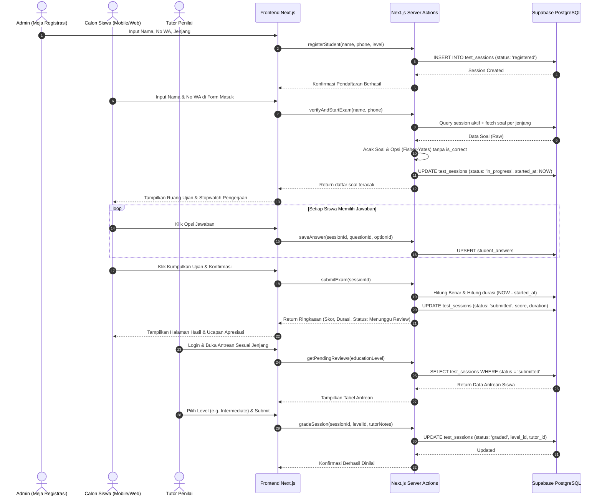
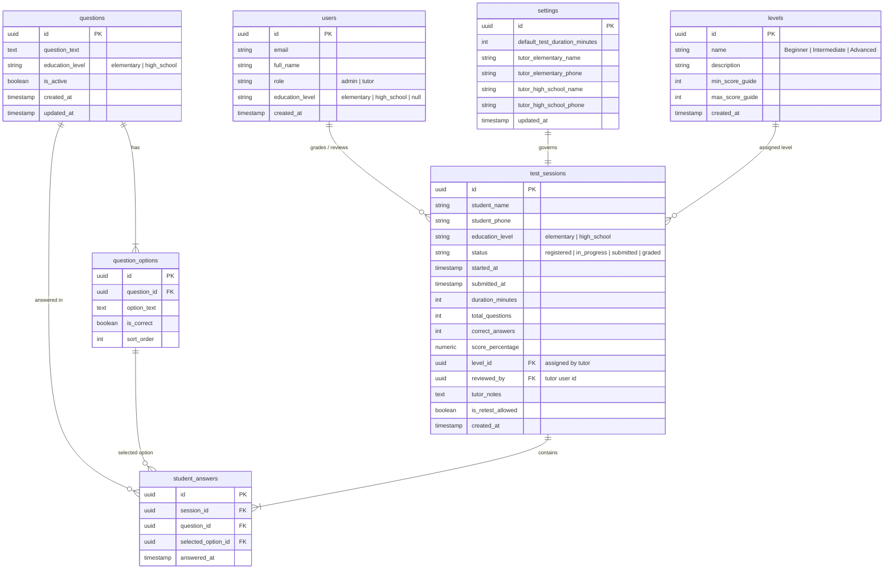

# Product Requirements Document (PRD)
## Up Speaking Placement Test System
**Platform Digitalisasi Tes Penempatan & Evaluasi Kemampuan Bahasa Inggris**

---

## 1. Overview

**Up Speaking Learning Centre** adalah lembaga bimbingan dan kursus bahasa Inggris yang melayani calon peserta didik dari berbagai kategori umur, mulai dari siswa sekolah dasar (*Elementary*) hingga tingkat menengah dan umum (*High School / General*). Untuk memastikan materi pembelajaran disampaikan secara optimal, lembaga menyelenggarakan tes penempatan (*placement test*) bagi setiap calon siswa sebelum memulai program belajar.

Sebelumnya, tes penempatan diselenggarakan secara konvensional menggunakan lembar soal fisik kertas. Praktik manual ini menimbulkan sejumlah kendala operasional nyata:
1. **Risiko Kebocoran dan Hafalan Soal:** Format soal fisik yang statis membuka celah bagi peserta didik untuk saling mencontek atau menghafal urutan jawaban dari peserta lain yang telah mengikuti tes lebih dahulu.
2. **Inefisiensi Koreksi & Beban Administrasi:** Staf lembaga harus mencocokkan lembar jawaban satu per satu secara manual, merekap nilai ke lembaran arsip fisik, dan mendokumentasikan riwayat secara terpisah yang rentan terselip atau rusak.
3. **Ketiadaan Metrik Objektif Durasi Pengerjaan:** Pada ujian massal di ruangan, staf pengawas kesulitan mengukur waktu pengerjaan aktual setiap individu secara akurat, padahal kecepatan pengerjaan merupakan salah satu indikator penting pemahaman bahasa Inggris peserta.

Sistem **Up Speaking Placement Test System** dibangun sebagai aplikasi web terintegrasi (*Progressive Web App / PWA*) yang memodernisasi seluruh alur tes penempatan. Sistem ini memusatkan proses registrasi calon siswa oleh Admin di meja pendaftaran, menghadirkan ruang ujian digital interaktif bagi siswa dengan **pengacakan butir soal dan opsi dinamis (Fisher-Yates Shuffle)** tanpa batasan waktu kaku (*stress-free untimed test*), serta menyediakan panel evaluasi khusus bagi **Tutor** untuk menentukan level penempatan (*Beginner*, *Intermediate*, atau *Advanced*) berdasarkan akurasi jawaban dan durasi pengerjaan riil.

Tujuan utama sistem ini adalah menghadirkan instrumen tes penempatan yang kredibel, teratur, dan bebas bias bagi lembaga, sekaligus memberikan kemudahan pengerjaan tanpa friksi berlebih bagi calon siswa.

---

## 2. Requirements

* **Aksesibilitas Platform:**
  * Berbasis *Progressive Web App (PWA)* yang sepenuhnya responsif di layar ponsel pintar (*smartphone*), tablet, dan laptop/desktop.
  * Dapat diakses instan melalui peramban web (*browser*) tanpa kewajiban mengunduh aplikasi dari app store.
* **Tipe Pengguna & Hak Akses:**
  1. **Siswa (Peserta Tes):**
     * Akses publik tanpa perlu mengingat username atau password baru.
     * Masuk ke sistem ujian menggunakan kombinasi **Nama Lengkap & Nomor WhatsApp** yang telah didaftarkan sebelumnya oleh Admin.
     * Mengerjakan butir soal pilihan ganda secara mandiri dan melihat ringkasan pengerjaan setelah submit.
  2. **Admin (Staf Meja Pendaftaran & Administrasi):**
     * Memerlukan autentikasi (*Email & Password*) via Supabase Auth.
     * Hak akses: Mendaftarkan calon siswa baru (Nama, No WA, Jenjang Pendidikan), mengelola Bank Soal (CRUD), memantau rekap riwayat global, mengelola pengaturan sistem, dan memberikan izin tes ulang (*retest permission*).
  3. **Tutor (Evaluator Akademik — Tutor Elementary & Tutor High School):**
     * Memerlukan autentikasi (*Email & Password*) via Supabase Auth dengan hak akses role Tutor.
     * Hak akses: Mengakses daftar antrean hasil tes siswa sesuai jenjangnya (Tutor Elementary menangani siswa Elementary; Tutor High School menangani siswa High School), menganalisis akurasi jawaban dan durasi pengerjaan, serta menetapkan level penempatan resmi beserta catatan evaluasi.
* **Mekanisme Pengerjaan & Integritas Data:**
  * **Pengacakan Dinamis Anti-Hafalan:** Soal dan pilihan jawaban diacak secara dinamis di tingkat server menggunakan algoritma **Fisher-Yates Shuffle** per sesi pengerjaan siswa.
  * **Penyajian Soal Sesuai Jenjang:** Siswa hanya menerima bank soal yang relevan dengan jenjang pendidikannya (`Elementary` atau `High School`).
  * **Pengerjaan Tanpa Batas Waktu Paksa (*Untimed with Duration Tracking*):** Siswa tidak dibebani hitung mundur waktu yang memaksa ujian berhenti otomatis. Sistem bekerja mencatat timestamp mulai (`started_at`) dan selesai (`submitted_at`) untuk menghitung durasi pengerjaan riil (dalam menit) sebagai bahan pertimbangan objektif bagi Tutor.
  * **Kerahasiaan Kunci Jawaban:** Atribut penanda kunci jawaban (`is_correct`) **diharamkan** dikirim ke browser siswa. Seluruh kalkulasi skor dilakukan 100% di server side (*Server Actions*).
  * **Auto-Save & Crash Recovery:** Jawaban tersimpan otomatis ke *Local Storage* dan server latar belakang secara *real-time*. Jika koneksi terputus atau tab tertutup, sesi dapat dipulihkan utuh.
  * **Pencegahan Tes Ganda:** Sesi tes siswa dikontrol oleh status registrasi. Siswa hanya dapat mengerjakan tes jika telah didaftarkan Admin. Setelah tes dikumpulkan, siswa tidak dapat mengulang tes kecuali Admin memberikan izin tes ulang.

---

## 3. Core Features

### 1. Registrasi Siswa Terpusat oleh Admin (*On-Desk Registration*)
* Formulir pendaftaran calon siswa pada Admin Panel:
  * **Nama Lengkap Calon Siswa**
  * **Nomor WhatsApp Siswa / Orang Tua**
  * **Pilihan Jenjang Pendidikan:** `Elementary (SD)` atau `High School (SMP / SMA / Umum)`.
* Sistem membuatkan sesi tes awal berstatus `registered` yang siap diakses oleh siswa di ruang ujian.
* Notifikasi validasi jika nomor WhatsApp dan nama siswa yang sama masih memiliki sesi tes yang belum diselesaikan.

### 2. Ruang Ujian Digital Interaktif (*Interactive Exam Room*)
* **Gerbang Masuk Cepat Siswa (*Quick Verification Entry*):** Siswa membuka web dan memasukkan Nama Lengkap serta Nomor WhatsApp. Jika terdaftar dan berstatus `registered` atau `in_progress`, siswa langsung diarahkan ke lembar soal.
* **Filter Bank Soal per Jenjang:** Sistem hanya menyajikan butir-butir soal aktif yang ditandai sesuai jenjang siswa (`Elementary` atau `High School`).
* **Pengacakan Ganda (Fisher-Yates):** Urutan nomor soal dan posisi opsi pilihan ganda (A, B, C, D, dst.) selalu acak untuk setiap siswa.
* **Pencatatan Waktu Pengerjaan Riil:** Stopwatch tersembunyi/indikator waktu berjalan yang menghitung total menit pengerjaan sejak soal pertama dibuka hingga tombol kumpulkan ditekan.
* **Radio Cards Ramah Sentuhan:** Pilihan jawaban berukuran proporsional dan nyaman disentuh pada layar ponsel.
* **Palet Navigasi Soal:** Drawer kisi nomor soal yang menunjukkan status soal (sudah dijawab vs belum dijawab).
* **Mekanisme Auto-Save Realtime:** Jawaban disimpan seketika saat opsi diklik tanpa butuh tombol simpan manual.
* **Modal Konfirmasi Pengumpulan:** Dialog konfirmasi sebelum submit akhir untuk mencegah ketidaksengajaan klik.

### 3. Halaman Selesai & Ringkasan Performa Siswa (*Submission & Feedback Screen*)
* **Apresiasi & Ucapan Hangat:** Pesan ramah dan humanis mengapresiasi penyelesaian tes (*"Awesome Job, [Nama Siswa]! Tes penempatan Anda berhasil dikumpulkan"*).
* **Ringkasan Data Objektif:**
  * Total Soal & Jawaban Terjawab (contoh: `30 / 30 Soal`)
  * Akurasi Jawaban & Skor Persentase (contoh: `24 Benar (80%)`)
  * Durasi Pengerjaan Aktual (contoh: `16 Menit`)
* **Status Evaluasi Terbuka:**
  * Lencana status: `🟡 Menunggu Konfirmasi Level oleh Tutor`.
  * Catatan informasi: Memberi tahu bahwa penentuan level kelas definitif sedang ditinjau dan akan diputuskan secara komprehensif oleh Tutor penanggung jawab.
* **Direct Call to Action (CTA):** Tombol langsung menghubungi Tutor via WhatsApp atau instruksi menemui staf di meja lembaga.

### 4. Panel Evaluasi Khusus Tutor (*Tutor Evaluation & Leveling Dashboard*)
* Halaman autentikasi login khusus akun Tutor (Email & Password).
* **Pemisahan Antrean Siswa per Jenjang:**
  * Tutor Elementary hanya mengakses data siswa Elementary.
  * Tutor High School hanya mengakses data siswa High School.
* **Tabel Antrean Penilaian:**
  * Status pengerjaan: `Menunggu Review (Submitted)` dan `Selesai Dinilai (Graded)`.
  * Ringkasan performa: Nama Siswa, No WA, Tanggal Tes, Durasi Pengerjaan Riil, dan Akurasi Nilai Skor.
* **Modal / Form Penetapan Level:**
  * Tutor meninjau performa pengerjaan siswa.
  * Dropdown pemilihan level resmi:
    * `Beginner`
    * `Intermediate`
    * `Advanced`
  * Input catatan/feedback evaluasi tutor (opsional).
  * Tombol aksi **"Simpan & Tetapkan Level"**.
* Perubahan status sesi menjadi `graded` dan level resmi tersimpan permanen di database.

### 5. Manajemen Bank Soal Dinamis oleh Admin (*Admin Question Bank*)
* Tabel butir soal aktif dengan filter jenjang (`Elementary` / `High School`).
* Form tambah dan edit soal:
  * Teks pertanyaan soal (*rich text / plain text*).
  * Opsi jawaban dinamis (fleksibel 2 hingga 5 pilihan opsi A–E).
  * Penentuan kunci jawaban benar (*radio selection*).
  * Pemilihan target jenjang pendidikan.
* Mekanisme **Soft Delete** (`is_active = false`) agar integritas riwayat jawaban siswa terdahulu tidak rusak.

### 6. Rekapitulasi Global & Ekspor Dokumen (*Reporting & Analytics*)
* **4 Kartu Metrik Utama:** Total Peserta, Siswa Menunggu Evaluasi, Rata-rata Skor, dan Rata-rata Durasi Pengerjaan.
* **Tabel Riwayat Terpusat:** Menampilkan seluruh data peserta (Nama, No WA, Jenjang, Skor %, Durasi Pengerjaan, Level Resmi, dan Nama Tutor Penilai).
* **Pencarian & Filter Multikolom:** Filter berdasarkan Jenjang Pendidikan, Status Penilaian, dan Level Penempatan.
* **Fitur Izin Tes Ulang (*Retest Permission*):** Tombol aksi untuk mengizinkan peserta mengulang tes penempatan tanpa menghapus arsip nilai tes sebelumnya.
* **Ekspor Data:** Tombol unduh laporan ke format **Excel (.xlsx)** dan **PDF** yang otomatis mengikuti filter tabel yang sedang aktif.

---

## 4. User Flow

### Flow 1: Pendaftaran Siswa oleh Admin (Meja Registrasi)
1. Calon siswa datang ke meja pendaftaran Up Speaking Learning Centre.
2. Admin membuka menu pendaftaran di dashboard (`/admin/dashboard` atau modal pendaftaran).
3. Admin menginput: **Nama Lengkap Siswa**, **Nomor WhatsApp**, dan **Jenjang Pendidikan** (`Elementary` / `High School`).
4. Admin menekan tombol **"Daftarkan Siswa"**.
5. Sistem membuat *record* baru di tabel `test_sessions` dengan status `registered`.
6. Admin mempersilakan siswa membuka web placement test di perangkat ponsel siswa atau komputer lembaga.

### Flow 2: Siswa Mengerjakan Tes Penempatan
1. Siswa mengakses URL aplikasi web (misal: `/`).
2. Siswa memasukkan **Nama Lengkap** dan **Nomor WhatsApp** pada form masuk, lalu menekan **"Mulai Ujian"**.
3. Sistem memverifikasi kecocokan data dengan sesi berstatus `registered` atau `in_progress`.
4. Sistem mengarahkan siswa ke Ruang Ujian (`/exam`).
5. Server mengambil butir-butir soal sesuai jenjang, mengacak urutan soal dan opsi via Fisher-Yates (tanpa field `is_correct`), dan mencatat timestamp mulai pengerjaan.
6. Siswa menjawab butir soal satu per satu (jawaban tersimpan otomatis via Server Action di latar belakang). Siswa mengerjakan dengan tenang tanpa tekanan batas countdown timer.
7. Setelah seluruh soal selesai, siswa menekan tombol **"Kumpulkan Ujian"** pada navbar bawah.
8. Muncul dialog modal konfirmasi; siswa menekan **"Ya, Kumpulkan"**.
9. Server menghitung total benar, akurasi %, durasi pengerjaan aktual (`submitted_at - started_at`), mengubah status sesi menjadi `submitted`, dan mengarahkan siswa ke Halaman Hasil (`/result`).
10. Siswa membaca ringkasan performa dan pesan ramah bahwa level sedang ditinjau oleh Tutor.

### Flow 3: Evaluasi & Penetapan Level oleh Tutor
1. Tutor masuk ke aplikasi melalui portal login tutor (`/admin` atau `/tutor`).
2. Tutor membuka antrean evaluasi jenjangnya (misal: Tutor High School membuka tab antrean High School).
3. Tutor melihat daftar siswa dengan status `submitted` (Menunggu Review).
4. Tutor mengklik baris siswa untuk melihat rincian performa (Akurasi % dan Durasi Pengerjaan Riil).
5. Berdasarkan keahlian profesional dan data performa tersebut, Tutor memilih level penempatan (`Beginner`, `Intermediate`, atau `Advanced`), menambahkan catatan evaluasi jika diperlukan, lalu menekan **"Tetapkan Level"**.
6. Sistem memperbarui status sesi menjadi `graded`, mencatat ID tutor penilai, dan menyimpan level resmi.
7. Data hasil otomatis terbarui di rekapitulasi riwayat dan dapat diakses untuk koordinasi kelas belajar.

---

## 5. Architecture

Berikut sequence diagram yang menggambarkan interaksi antar-aktor dalam siklus tes penempatan:

---

## 6. Database Schema

### Mermaid Entity-Relationship Diagram (ERD)

### Tabel Deskripsi Entitas Database:

| Nama Tabel | Deskripsi & Peran dalam Sistem |
|---|---|
| **`users` / `profiles`** | Menyimpan identitas akun staf lembaga dengan pembedaan `role` (`admin` atau `tutor`) serta penugasan jenjang bagi tutor. |
| **`settings`** | Konfigurasi global lembaga, termasuk kontak WhatsApp resmi tutor penanggung jawab jenjang. |
| **`levels`** | Master data tingkatan kelas (*Beginner*, *Intermediate*, *Advanced*) beserta deskripsi kompetensinya. |
| **`questions`** | Bank butir soal dengan label target jenjang pendidikan (`elementary` atau `high_school`) dan status keaktifan (*soft delete*). |
| **`question_options`** | Pilihan opsi jawaban dinamis (A–D/E) yang berelasi ke butir soal dengan penanda `is_correct` (terisolasi di server). |
| **`test_sessions`** | Entitas utama pengerjaan tes: mencatat identitas siswa, status alur (`registered` $\rightarrow$ `in_progress` $\rightarrow$ `submitted` $\rightarrow$ `graded`), durasi pengerjaan riil, skor akurasi, dan penetapan level resmi oleh Tutor. |
| **`student_answers`** | Menyimpan setiap pilihan jawaban siswa per soal secara real-time untuk audit dan pemulihan sesi (*crash recovery*). |

---

## 7. Design & Technical Constraints

* **Frontend & Framework:**
  * **Next.js (App Router, TypeScript):** Memaksimalkan keamanan data melalui *Server Actions* dan performa render cepat via *React Server Components*.
  * **Tailwind CSS & Lucide React:** Utility styling yang ringan, adaptif di layar ponsel calon siswa (*mobile-first*), serta modern di dashboard desktop admin/tutor.
  * **Framer Motion & Canvas Confetti:** Pustaka animasi interaktif untuk transisi pergantian soal yang halus (*smooth page transition*), mikro-interaksi tombol, pembukaan modal dinamis, dan efek selebrasi penyelesaian ujian.
* **Database & Autentikasi:**
  * **Supabase (PostgreSQL & Supabase Auth):** Relasi PostgreSQL murni dengan Row Level Security (RLS) serta pengelolaan sesi admin dan tutor yang terisolasi.
* **Strict Blacklist (Bebas Bloatware):**
  * **Dilarang** menggunakan ORM berat (Prisma / Drizzle) yang memperbesar bundle aplikasi. Cukup gunakan `@supabase/supabase-js`.
  * **Dilarang** menggunakan state management rumit (Redux / Zustand). Gunakan React State standar dan Local Storage browser untuk auto-save.
  * **Dilarang** melakukan *hard delete* fisik pada tabel `questions`. Wajib menggunakan *soft delete* (`is_active = false`).
* **Integritas Waktu & Keamanan:**
  * Timestamp mulai (`started_at`) dan selesai (`submitted_at`) dicatat murni dari waktu server database, sehingga durasi pengerjaan tidak dapat dimanipulasi oleh jam lokal perangkat siswa.
* **Desain UI/UX & Interaksi:**
  * Mengutamakan tipografi yang bersih dan mudah dibaca oleh siswa sekolah dasar (*Elementary*) maupun remaja/dewasa (*High School*).
  * Gerakan visual yang luwes dan responsif menggunakan prinsip *spring animation* pada perangkat mobile siswa.
  * Palet warna profesional yang merefleksikan identitas Up Speaking Learning Centre (modern, edukatif, dan ramah).
