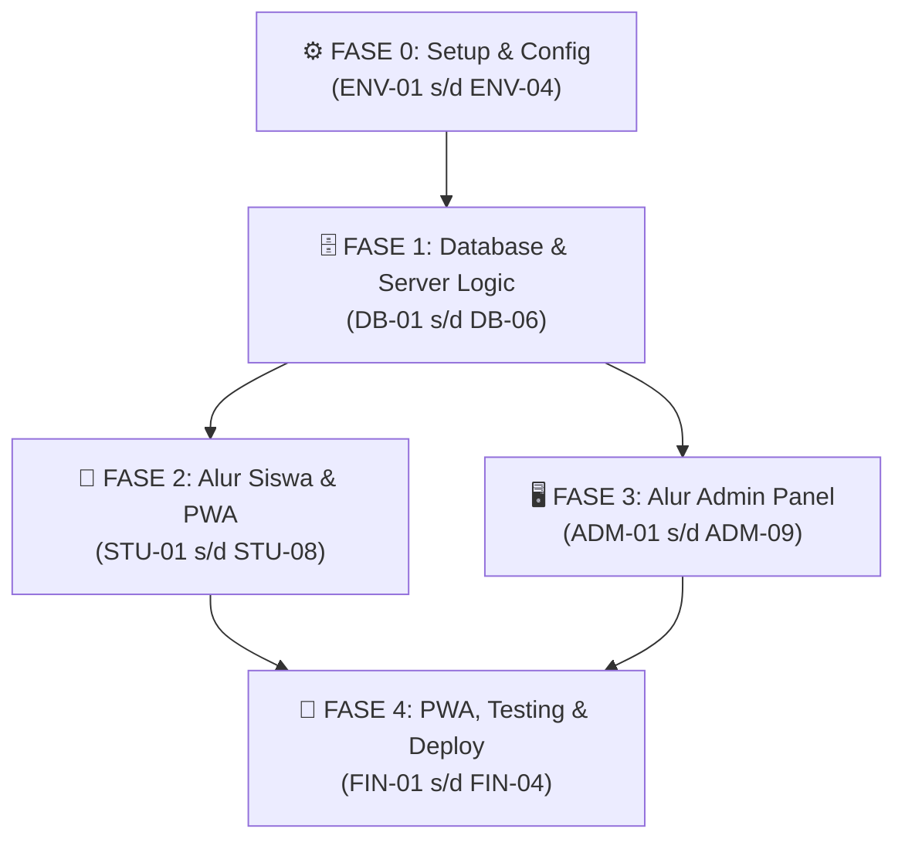

# Task Breakdown — Up Speaking Placement Test System
**Dokumen:** Task Breakdown & Development Checklist  
**Versi:** 1.0.0  
**Tanggal:** 1 Oktober 2026  
**Referensi Utama:** [PRD.md](PRD.md) · [UI_FLOW.md](UI_FLOW.md)  
**Tech Stack:** Next.js (App Router, TypeScript) · Tailwind CSS · Supabase (PostgreSQL & Auth) · PWA  

---

## Konvensi Dokumen

Setiap task menggunakan format checklist berikut:
- **Selesai** : Centang `[ ]` menjadi `[x]` saat task selesai dikerjakan.
- **ID** : Kode unik task berdasarkan area pengerjaan.
- **Deskripsi** : Instruksi tindakan teknis yang harus diselesaikan.
- **Depends On** : ID task prasyarat yang harus selesai lebih dulu.
- **Estimasi** : Perkiraan waktu pengerjaan normal.
- **Prioritas** : `🔴 Wajib` (MVP Inti) · `🟡 Penting` · `🟢 Opsional`.

### Prefix Kode Task:
| Prefix | Area Pengerjaan | Platform / Scope |
|---|---|---|
| `ENV` | Setup & Konfigurasi Proyek | Next.js, Tailwind, Supabase Config |
| `DB` | Database & Server Actions | Supabase PostgreSQL, DDL, Seed, API |
| `STU` | Alur Siswa (Peserta Tes) | Landing Page, Exam Room, Auto-Save, Hasil |
| `ADM` | Alur Admin Panel (Staf) | Auth, Dashboard, CRUD Soal, Settings, Ekspor |
| `FIN` | PWA, Testing & Deployment | PWA Manifest, Crash Recovery Test, Deploy |

---

## Fase 0 — Setup & Konfigurasi Proyek (`ENV`)

| Selesai | ID | Deskripsi | Depends On | Estimasi | Prioritas |
|---|---|---|---|---|---|
| `[x]` | `ENV-01` | Inisialisasi project Next.js dengan App Router, TypeScript, dan Tailwind CSS di workspace root | — | 30 menit | 🔴 Wajib |
| `[x]` | `ENV-02` | Install dependensi pendukung: `@supabase/supabase-js`, `lucide-react`, `canvas-confetti`, dan utilitas styling (`clsx`, `tailwind-merge`) | `ENV-01` | 15 menit | 🔴 Wajib |
| `[x]` | `ENV-03` | Pindahkan aset logo dari folder `assets/logo/` ke `public/` untuk favicon dan komponen branding visual | `ENV-01` | 15 menit | 🔴 Wajib |
| `[x]` | `ENV-04` | Setup koneksi Supabase: buat file `.env.local` (URL & Anon Key) serta helper client/server Supabase (`lib/supabase.ts`) | `ENV-02` | 30 menit | 🔴 Wajib |

---

## Fase 1 — Database & Logika Server (`DB`)

| Selesai | ID | Deskripsi | Depends On | Estimasi | Prioritas |
|---|---|---|---|---|---|
| `[ ]` | `DB-01` | Buat skrip DDL SQL migration Supabase untuk 6 tabel: `settings`, `levels`, `questions`, `question_options`, `test_sessions`, dan `student_answers` | `ENV-04` | 1 jam | 🔴 Wajib |
| `[ ]` | `DB-02` | Terapkan proteksi Row Level Security (RLS) & indeks performa pada tabel `test_sessions` dan `question_options` | `DB-01` | 30 menit | 🔴 Wajib |
| `[ ]` | `DB-03` | Buat seeder SQL data awal: durasi tes (45 menit), 3 konfigurasi level default (Beginner, Intermediate, Advanced), dan 5-10 butir soal uji coba dummy | `DB-01` | 45 menit | 🔴 Wajib |
| `[ ]` | `DB-04` | Buat Server Action / API `startSession`: validasi format WA (normalisasi ke `628xxx`), cek fraud 24 jam/sesi berjalan, buat sesi baru, dan return daftar soal teracak (tanpa field `is_correct`) | `DB-02`, `DB-03` | 1.5 jam | 🔴 Wajib |
| `[ ]` | `DB-05` | Buat Server Action / API `saveAnswer`: upsert pilihan jawaban siswa ke tabel `student_answers` di background | `DB-04` | 45 menit | 🔴 Wajib |
| `[ ]` | `DB-06` | Buat Server Action / API `submitExam`: validasi jawaban terhadap kunci di DB, hitung persentase skor, tentukan level, dan tandai sesi `completed` | `DB-04`, `DB-05` | 1.5 jam | 🔴 Wajib |

---

## Fase 2 — Alur Siswa / PWA (`STU`)

| Selesai | ID | Deskripsi | Depends On | Estimasi | Prioritas |
|---|---|---|---|---|---|
| `[ ]` | `STU-01` | Buat halaman Landing Page (`/`): Navbar logo, Hero section, info fitur tes, panduan, dan tombol CTA | `ENV-03` | 1.5 jam | 🔴 Wajib |
| `[ ]` | `STU-02` | Buat Modal / Bottom Sheet pendaftaran: input Nama Lengkap & Nomor WhatsApp, integrasi start session, dan deteksi pemulihan sesi aktif | `STU-01`, `DB-04` | 1.5 jam | 🔴 Wajib |
| `[ ]` | `STU-03` | Buat layout Ruang Ujian (`/exam`): Sticky Header (Nama, Countdown Timer tersinkronisasi server, badge auto-save hijau) | `STU-02` | 1 jam | 🔴 Wajib |
| `[ ]` | `STU-04` | Buat komponen Soal & Opsi Jawaban: Radio Card interaktif yang ramah sentuhan layar ponsel (mobile tap-friendly) | `STU-03` | 1 jam | 🔴 Wajib |
| `[ ]` | `STU-05` | Implementasi Bottom Navigation Bar (`Sebelumnya`, `Selanjutnya`, dan `Kumpulkan Ujian` di nomor terakhir) serta Bottom Sheet Kisi/Palet Soal (indikator Hijau, Abu-abu, Biru) | `STU-04` | 1.5 jam | 🔴 Wajib |
| `[ ]` | `STU-06` | Implementasi mekanisme Crash Recovery & Auto-Save di LocalStorage: restorasi jawaban dan sisa waktu jika halaman ter-refresh/tertutup | `STU-04`, `DB-05` | 1.5 jam | 🔴 Wajib |
| `[ ]` | `STU-07` | Buat Modal Konfirmasi Pengumpulan (alert jika ada soal belum dijawab) dan aksi submit otomatis ketika waktu habis (00:00) | `STU-05`, `DB-06` | 1 jam | 🔴 Wajib |
| `[ ]` | `STU-08` | Buat Halaman Hasil (`/result`): kartu pencapaian skor %, rincian benar/total, badge level, deskripsi rekomendasi kelas, tombol Selesai, dan tombol direct WA ke Admin | `STU-07` | 1.5 jam | 🔴 Wajib |

---

## Fase 3 — Alur Admin Panel (`ADM`)

| Selesai | ID | Deskripsi | Depends On | Estimasi | Prioritas |
|---|---|---|---|---|---|
| `[ ]` | `ADM-01` | Buat Halaman Login Admin (/admin): autentikasi email & password via Supabase Auth + proteksi rute middleware admin | `ENV-04` | 1.5 jam | 🔴 Wajib |
| `[ ]` | `ADM-02` | Buat Layout Admin Panel: Sidebar navigasi responsif, Header topbar, profil admin, dan tombol Logout | `ADM-01` | 1.5 jam | 🔴 Wajib |
| `[ ]` | `ADM-03` | Buat Halaman Dashboard (/admin/dashboard): 4 kartu ringkasan metrik (Total Peserta, Jumlah Beginner, Intermediate, Advanced) | `ADM-02`, `DB-01` | 1 jam | 🔴 Wajib |
| `[ ]` | `ADM-04` | Buat Tabel Riwayat Hasil Siswa: kolom info sesi, nilai %, badge level, fitur search pencarian instan (Nama/WA), dan filter dropdown per level | `ADM-03` | 1.5 jam | 🔴 Wajib |
| `[ ]` | `ADM-05` | Implementasikan fitur Aksi "Izinkan Tes Ulang" (*Retest Permission*): tombol buka kunci tes untuk no. WA tertentu tanpa menghapus riwayat lama | `ADM-04` | 1 jam | 🔴 Wajib |
| `[ ]` | `ADM-06` | Implementasikan fitur Ekspor Data: tombol unduh file Excel (`.xlsx`) dan PDF cetak rapi yang otomatis mengikuti filter aktif di layar | `ADM-04` | 2 jam | 🟡 Penting |
| `[ ]` | `ADM-07` | Buat Halaman Manajemen Bank Soal (`/admin/questions`): tabel daftar soal aktif dengan tombol aksi Edit & Soft Delete | `ADM-02`, `DB-01` | 1.5 jam | 🔴 Wajib |
| `[ ]` | `ADM-08` | Buat Modal Form Tambah/Edit Soal: input teks soal, deret pilihan jawaban dinamis (+ Tambah Pilihan / 🗑️ Hapus min. 2), dan radio button kunci jawaban benar | `ADM-07` | 2 jam | 🔴 Wajib |
| `[ ]` | `ADM-09` | Buat Halaman Pengaturan (`/admin/settings`): form ubah durasi tes (menit) & konfigurasi rentang persentase 3 level (validasi bersambung 0-100%) | `ADM-02`, `DB-01` | 1.5 jam | 🔴 Wajib |

---

## Fase 4 — PWA, Testing & Deployment (`FIN`)

| Selesai | ID | Deskripsi | Depends On | Estimasi | Prioritas |
|---|---|---|---|---|---|
| `[ ]` | `FIN-01` | Konfigurasi Web App Manifest (`manifest.json`) dan icon PWA: aplikasi dapat diinstal di homescreen ponsel tanpa lewat Play Store | `STU-08` | 45 menit | 🔴 Wajib |
| `[ ]` | `FIN-02` | Pengujian simulasi kendala jaringan & Crash Recovery: tes tutup tab browser HP di tengah ujian dan pastikan sesi serta jawaban kembali utuh | `STU-06` | 1 jam | 🔴 Wajib |
| `[ ]` | `FIN-03` | Pengujian end-to-end lengkap: alur pengerjaan siswa hingga rekap nilai dan ekspor laporan di dashboard admin | Semua `STU-*`, `ADM-*` | 1.5 jam | 🔴 Wajib |
| `[ ]` | `FIN-04` | Deployment aplikasi ke platform hosting (Vercel / Netlify) dan koneksi database Supabase production | `FIN-01` s/d `FIN-03` | 1 jam | 🔴 Wajib |

---

## Ringkasan & Peta Dependensi

### Jumlah Task per Area:
| Area | Wajib 🔴 | Penting 🟡 | Total Task |
|---|---|---|---|
| Setup Proyek (`ENV`) | 4 | 0 | **4** |
| Database & Server (`DB`) | 6 | 0 | **6** |
| Alur Siswa (`STU`) | 8 | 0 | **8** |
| Admin Panel (`ADM`) | 8 | 1 | **9** |
| PWA & Deploy (`FIN`) | 4 | 0 | **4** |
| **Total** | **30** | **1** | **31 Task** |

---

### Alur Eksekusi (Dependency Diagram):

