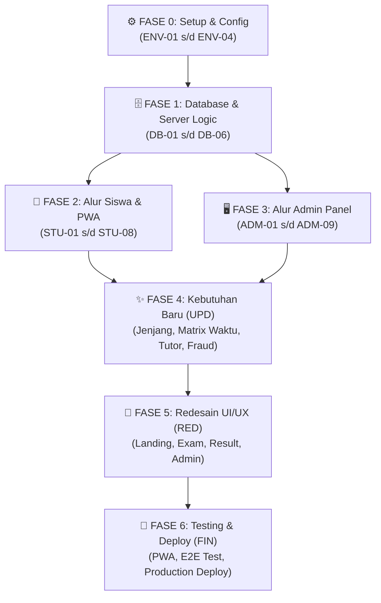

# Task Breakdown — Up Speaking Placement Test System
**Dokumen:** Task Breakdown & Development Checklist  
**Versi:** 1.3.0  
**Tanggal:** 4 Oktober 2026  
**Referensi Utama:** [PRD.md](PRD.md) · [UI_FLOW.md](UI_FLOW.md)  
**Tech Stack:** Next.js (App Router, TypeScript) · Tailwind CSS · Supabase (PostgreSQL & Auth) · PWA  

---

## Konvensi Dokumen

Setiap task menggunakan format checklist berikut:
- **Selesai** : Centang `[ ]` menjadi `[x]` saat task selesai dikerjakan dan diverifikasi.
- **ID** : Kode unik task berdasarkan area pengerjaan.
- **Deskripsi** : Instruksi tindakan teknis yang harus diselesaikan.
- **Depends On** : ID task prasyarat yang harus selesai lebih dulu.
- **Estimasi** : Perkiraan waktu pengerjaan normal.
- **Prioritas** : `🔴 Wajib` (MVP Inti) · `🟡 Penting` · `🟢 Opsional`.
- **Kriteria Selesai** : Kondisi konkret yang dapat diuji untuk menyatakan task tuntas.

### Prefix Kode Task:
| Prefix | Area Pengerjaan | Platform / Scope |
|---|---|---|
| `ENV` | Setup & Konfigurasi Proyek | Next.js, Tailwind, Supabase Config |
| `DB` | Database & Server Actions | Supabase PostgreSQL, DDL, Seed, API |
| `STU` | Alur Siswa (Peserta Tes) | Landing Page, Exam Room, Auto-Save, Hasil |
| `ADM` | Alur Admin Panel (Staf) | Auth, Dashboard, CRUD Soal, Settings, Ekspor |
| `UPD` | Penyesuaian Kebutuhan Baru | Jenjang Pendidikan, Matrix Skor+Waktu, Tutor, Fraud Permanen |
| `FIN` | PWA, Testing & Deployment | PWA Manifest, Crash Recovery Test, Deploy |

---

## Fase 0 — Setup & Konfigurasi Proyek (`ENV`)

| Selesai | ID | Deskripsi | Depends On | Estimasi | Prioritas | Kriteria Selesai |
|---|---|---|---|---|---|---|
| `[x]` | `ENV-01` | Inisialisasi project Next.js dengan App Router, TypeScript, dan Tailwind CSS di workspace root | — | 30 menit | 🔴 Wajib | Project terinisialisasi dan `npm run dev` dapat berjalan |
| `[x]` | `ENV-02` | Install dependensi pendukung: `@supabase/supabase-js`, `lucide-react`, `canvas-confetti`, dan utilitas styling (`clsx`, `tailwind-merge`) | `ENV-01` | 15 menit | 🔴 Wajib | Seluruh pustaka terpasang di `package.json` |
| `[x]` | `ENV-03` | Pindahkan aset logo dari folder `assets/logo/` ke `public/` untuk favicon dan komponen branding visual | `ENV-01` | 15 menit | 🔴 Wajib | Aset logo tersedia di folder `public/` dan favicon aktif |
| `[x]` | `ENV-04` | Setup koneksi Supabase: buat file `.env.local` (URL & Anon Key) serta helper client/server Supabase (`lib/supabase.ts`) | `ENV-02` | 30 menit | 🔴 Wajib | Koneksi Supabase client dan server helper berhasil dibuat |

---

## Fase 1 — Database & Logika Server Awal (`DB`)

| Selesai | ID | Deskripsi | Depends On | Estimasi | Prioritas | Kriteria Selesai |
|---|---|---|---|---|---|---|
| `[x]` | `DB-01` | Buat skrip DDL SQL migration Supabase untuk 6 tabel: `settings`, `levels`, `questions`, `question_options`, `test_sessions`, dan `student_answers` | `ENV-04` | 1 jam | 🔴 Wajib | Tabel terbuat di Supabase dengan skema relasional |
| `[x]` | `DB-02` | Terapkan proteksi Row Level Security (RLS) & indeks performa pada tabel `test_sessions` dan `question_options` | `DB-01` | 30 menit | 🔴 Wajib | Kebijakan RLS aktif dan query terproteksi |
| `[x]` | `DB-03` | Buat seeder SQL data awal: durasi tes (45 menit), 3 konfigurasi level default, dan butir soal uji coba dummy | `DB-01` | 45 menit | 🔴 Wajib | Data seeder awal masuk ke database |
| `[x]` | `DB-04` | Buat Server Action `startSession`: validasi format WA, cek sesi aktif, dan return soal teracak Fisher-Yates tanpa `is_correct` | `DB-02`, `DB-03` | 1.5 jam | 🔴 Wajib | Sesi terbentuk dan soal diacak tanpa bocoran kunci |
| `[x]` | `DB-05` | Buat Server Action `saveAnswer`: upsert pilihan jawaban siswa ke tabel `student_answers` di background | `DB-04` | 45 menit | 🔴 Wajib | Jawaban tersimpan otomatis secara realtime |
| `[x]` | `DB-06` | Buat Server Action `submitExam`: validasi jawaban, hitung persentase skor, tentukan level, dan tandai sesi `completed` | `DB-04`, `DB-05` | 1.5 jam | 🔴 Wajib | Sesi terkunci `completed` dan nilai terhitung |

---

## Fase 2 — Alur Siswa Awal (`STU`)

| Selesai | ID | Deskripsi | Depends On | Estimasi | Prioritas | Kriteria Selesai |
|---|---|---|---|---|---|---|
| `[x]` | `STU-01` | Buat halaman Landing Page (`/`): Navbar logo, Hero section, info fitur tes, panduan, dan tombol CTA | `ENV-03` | 1.5 jam | 🔴 Wajib | Landing page tampil rapi dan responsif |
| `[x]` | `STU-02` | Buat Modal / Bottom Sheet pendaftaran: input Nama Lengkap & Nomor WhatsApp, integrasi start session | `STU-01`, `DB-04` | 1.5 jam | 🔴 Wajib | Form pendaftaran berfungsi membuka sesi ujian |
| `[x]` | `STU-03` | Buat layout Ruang Ujian (`/exam`): Sticky Header (Nama, Countdown Timer tersinkronisasi server, badge auto-save) | `STU-02` | 1 jam | 🔴 Wajib | Header ujian menampilkan timer dan auto-save |
| `[x]` | `STU-04` | Buat komponen Soal & Opsi Jawaban: Radio Card interaktif yang ramah sentuhan layar ponsel | `STU-03` | 1 jam | 🔴 Wajib | Opsi jawaban mudah dipilih pada ponsel |
| `[x]` | `STU-05` | Implementasi Bottom Navigation Bar (`Sebelumnya`, `Selanjutnya`, `Kumpulkan Ujian`) serta Drawer Kisi Soal | `STU-04` | 1.5 jam | 🔴 Wajib | Navigasi soal dan drawer kisi soal berfungsi |
| `[x]` | `STU-06` | Implementasi mekanisme Crash Recovery & Auto-Save di LocalStorage: restorasi jawaban dan sisa waktu | `STU-04`, `DB-05` | 1.5 jam | 🔴 Wajib | Browser tertutup dapat merestorasi status pengerjaan |
| `[x]` | `STU-07` | Buat Modal Konfirmasi Pengumpulan dan aksi submit otomatis ketika waktu habis | `STU-05`, `DB-06` | 1 jam | 🔴 Wajib | Dialog konfirmasi submit dan auto-submit 00:00 aktif |
| `[x]` | `STU-08` | Buat Halaman Hasil (`/result`): kartu pencapaian skor %, rincian benar/total, badge level, tombol Selesai | `STU-07` | 1.5 jam | 🔴 Wajib | Halaman hasil menampilkan nilai dan lencana level |

---

## Fase 3 — Alur Admin Panel Awal (`ADM`)

| Selesai | ID | Deskripsi | Depends On | Estimasi | Prioritas | Kriteria Selesai |
|---|---|---|---|---|---|---|
| `[x]` | `ADM-01` | Buat Halaman Login Admin (`/admin`): autentikasi email & password via Supabase Auth + middleware proteksi | `ENV-04` | 1.5 jam | 🔴 Wajib | Login admin berhasil dan rute admin terproteksi |
| `[x]` | `ADM-02` | Buat Layout Admin Panel: Sidebar navigasi responsif, Header topbar, profil admin, dan tombol Logout | `ADM-01` | 1.5 jam | 🔴 Wajib | Layout admin sidebar & header berjalan |
| `[x]` | `ADM-03` | Buat Halaman Dashboard (`/admin/dashboard`): 4 kartu ringkasan metrik | `ADM-02`, `DB-01` | 1 jam | 🔴 Wajib | Kartu metrik menampilkan statistik riil |
| `[x]` | `ADM-04` | Buat Tabel Riwayat Hasil Siswa: pencarian instan (Nama/WA) dan filter dropdown level | `ADM-03` | 1.5 jam | 🔴 Wajib | Tabel riwayat dapat dicari dan difilter |
| `[x]` | `ADM-05` | Implementasikan fitur Aksi "Izinkan Tes Ulang": tombol buka kunci tes nomor WA tertentu | `ADM-04` | 1 jam | 🔴 Wajib | Tombol izin tes ulang berhasil membuka akses |
| `[x]` | `ADM-06` | Implementasikan fitur Ekspor Data: tombol unduh file Excel (`.xlsx`) dan PDF terfilter | `ADM-04` | 2 jam | 🟡 Penting | File Excel dan PDF berhasil diunduh sesuai filter |
| `[x]` | `ADM-07` | Buat Halaman Manajemen Bank Soal (`/admin/questions`): tabel daftar soal aktif dengan Edit & Soft Delete | `ADM-02`, `DB-01` | 1.5 jam | 🔴 Wajib | Tabel soal aktif dan aksi soft delete berfungsi |
| `[x]` | `ADM-08` | Buat Modal Form Tambah/Edit Soal: opsi jawaban dinamis (+ Tambah / Hapus) dan radio kunci | `ADM-07` | 2 jam | 🔴 Wajib | Form tambah dan edit soal dengan opsi dinamis aktif |
| `[x]` | `ADM-09` | Buat Halaman Pengaturan (`/admin/settings`): form ubah durasi tes & rentang persentase 3 level | `ADM-02`, `DB-01` | 1.5 jam | 🔴 Wajib | Pengaturan durasi dan rentang level tersimpan |

---

## Fase 4 — Implementasi Kebutuhan Tambahan (`UPD`)

| Selesai | ID | Deskripsi | Depends On | Estimasi | Prioritas | Kriteria Selesai |
|---|---|---|---|---|---|---|
| `[x]` | `UPD-01` | **Skema DB Kebutuhan Baru:** Migration SQL tambah kolom `education_level` di `questions` & `test_sessions`, kolom `duration_minutes` di `test_sessions`, serta kolom tutor di `settings` | `DB-01` | 45 menit | 🔴 Wajib | Kolom baru terdaftar di database Supabase |
| `[x]` | `UPD-02` | **Server Action `startSession` Update:** Tambah parameter `education_level`, filter soal sesuai jenjang, dan fraud check permanen berbasis pasangan `(No WA + Nama)` | `UPD-01`, `DB-04` | 1 jam | 🔴 Wajib | Siswa hanya dapat soal sesuai jenjangnya; pasangan WA+Nama yang sudah tes diblokir permanen |
| `[x]` | `UPD-03` | **Server Action `submitExam` & Matrix Evaluasi:** Hitung durasi pengerjaan riil, evaluasi matrix level (Skor % + Waktu pengerjaan menit), dan return kontak tutor jenjang | `UPD-01`, `DB-06` | 1 jam | 🔴 Wajib | Siswa skor >= 80% durasi > 25m turun ke Intermediate; skor 60-79% durasi > 20m turun ke Beginner |
| `[x]` | `UPD-04` | **UI Registrasi Siswa (`/`):** Tambah input pilihan Jenjang Pendidikan (`Elementary` / `High School`) pada modal registrasi | `UPD-02`, `STU-02` | 45 menit | 🔴 Wajib | Siswa wajib memilih jenjang sebelum tes dimulai |
| `[x]` | `UPD-05` | **UI Halaman Hasil (`/result`):** Tampilkan durasi pengerjaan riil, rekomendasi kelas jenjang+level, dan kartu kontak Tutor via WhatsApp | `UPD-03`, `STU-08` | 1 jam | 🔴 Wajib | Hasil menampilkan durasi pengerjaan dan tombol WA tutor jenjang terkait |
| `[x]` | `UPD-06` | **UI Admin Bank Soal (`/admin/questions`):** Tambah filter jenjang pada tabel soal dan pilihan jenjang pada modal form tambah/edit soal | `UPD-01`, `ADM-08` | 1 jam | 🔴 Wajib | Admin dapat memfilter dan menginput soal per jenjang |
| `[x]` | `UPD-07` | **UI Admin Pengaturan (`/admin/settings`):** Form matrix penilaian level (skor + batas waktu menit) dan form kontak tutor per jenjang (Elementary & High School) | `UPD-01`, `ADM-09` | 1 jam | 🔴 Wajib | Pengaturan matrix level dan kontak tutor tersimpan ke database |
| `[x]` | `UPD-08` | **UI Admin Dashboard (`/admin/dashboard`):** Tambah kolom Jenjang dan Durasi Pengerjaan pada tabel riwayat serta filter dropdown jenjang | `UPD-01`, `ADM-04` | 45 menit | 🔴 Wajib | Tabel riwayat menampilkan jenjang dan durasi serta dapat difilter per jenjang |

---

---

## Fase 5 — Redesain Modern & UI/UX Polish (`RED`)

| Selesai | ID | Deskripsi | Depends On | Estimasi | Prioritas | Kriteria Selesai |
|---|---|---|---|---|---|---|
| `[ ]` | `RED-01` | **Redesain Modern Landing Page & Modal Registrasi (`/`):** Hero section bergengsi, tipografi tajam, kartu panduan bertekstur, dan modal ramah mobile | `FIN-02` | 1.5 jam | 🔴 Wajib | Tampilan landing page dan form registrasi modern, responsif, dan elegan |
| `[ ]` | `RED-02` | **Redesain Ruang Ujian Interaktif (`/exam`):** Sleek header countdown timer, kartu pertanyaan fokus, radio cards taktil, dan palet soal modern | `RED-01` | 1.5 jam | 🔴 Wajib | Pengalaman ujian fokus (*hyper-focused exam UI*) dan interaktif |
| `[ ]` | `RED-03` | **Redesain Halaman Hasil Placement Test (`/result`):** Showcase skor megah, lencana level prestisius, rincian akurasi/durasi, dan CTA tutor WA | `RED-02` | 1.5 jam | 🔴 Wajib | Tampilan hasil memukau dan tombol kontak tutor mengundang aksi |
| `[ ]` | `RED-04` | **Redesain Admin Panel (`/admin/*`):** Sidebar sleek, metric cards mewah, tabel riwayat tajam, modal CRUD soal, dan pengaturan bersih | `RED-03` | 2 jam | 🔴 Wajib | Seluruh antarmuka admin panel berstandar *enterprise dashboard* |

---

## Fase 6 — PWA, Testing & Deployment (`FIN`)

| Selesai | ID | Deskripsi | Depends On | Estimasi | Prioritas | Kriteria Selesai |
|---|---|---|---|---|---|---|
| `[x]` | `FIN-01` | Konfigurasi Web App Manifest (`manifest.json`) dan icon PWA agar dapat diinstal di homescreen | `STU-08` | 45 menit | 🔴 Wajib | Web App Manifest aktif dan lolos audit PWA |
| `[x]` | `FIN-02` | Pengujian simulasi kendala jaringan & Crash Recovery: tes tutup tab browser HP di tengah ujian dan pastikan sesi kembali utuh | `STU-06`, `UPD-02` | 1 jam | 🔴 Wajib | Sesi dan jawaban pulih setelah browser dibuka kembali |
| `[ ]` | `FIN-03` | Pengujian end-to-end lengkap: alur pengerjaan Elementary & High School, evaluasi matrix skor+waktu, hingga rekap dashboard admin | `RED-04` | 1.5 jam | 🔴 Wajib | Pengujian alur siswa per jenjang dan admin berjalan tanpa bug |
| `[ ]` | `FIN-04` | Deployment aplikasi ke platform hosting (Vercel / Netlify) dan koneksi database Supabase production | `FIN-01` s/d `FIN-03` | 1 jam | 🔴 Wajib | Aplikasi live di URL produksi dan siap digunakan |

---

## Ringkasan & Peta Dependensi

### Jumlah Task per Area:
| Area | Wajib 🔴 | Penting 🟡 | Total Task | Selesai | Sisa |
|---|---|---|---|---|---|
| Setup Proyek (`ENV`) | 4 | 0 | **4** | 4 | 0 |
| Database & Server (`DB`) | 6 | 0 | **6** | 6 | 0 |
| Alur Siswa Awal (`STU`) | 8 | 0 | **8** | 8 | 0 |
| Admin Panel Awal (`ADM`) | 8 | 1 | **9** | 9 | 0 |
| Kebutuhan Baru (`UPD`) | 8 | 0 | **8** | 8 | 0 |
| Redesain UI/UX (`RED`) | 4 | 0 | **4** | 0 | 4 |
| PWA & Deploy (`FIN`) | 4 | 0 | **4** | 2 | 2 |
| **Total** | **42** | **1** | **43 Task** | **37** | **6** |

---

### Alur Eksekusi (Dependency Diagram):

