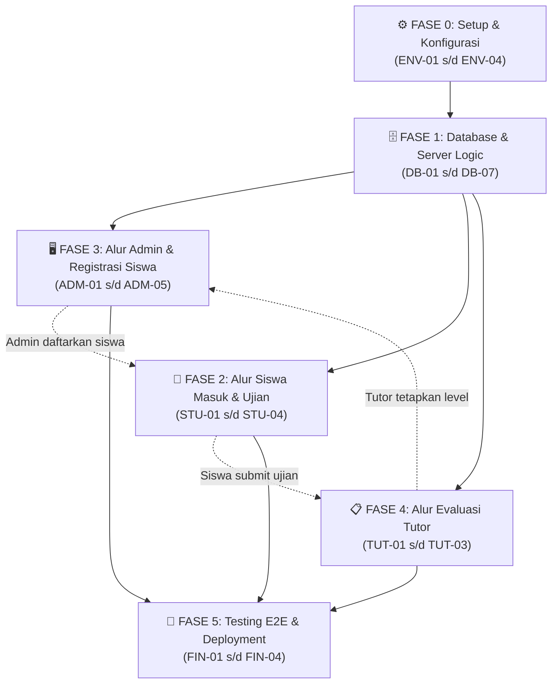

# Task Breakdown — Up Speaking Placement Test System
**Dokumen:** Task Breakdown & Development Checklist  
**Versi:** 2.0.0  
**Tanggal:** 5 Oktober 2026  
**Referensi Utama:** [PRD.md](PRD.md) · [UI_FLOW.md](UI_FLOW.md)  
**Tech Stack:** Next.js (App Router, TypeScript) · Tailwind CSS · Framer Motion · Supabase (PostgreSQL & Auth) · PWA  
**Asumsi Pengerjaan:** 1 developer, fokus pada implementasi fitur inti terintegrasi.  

---

## Konvensi Dokumen

Setiap task menggunakan format checklist berikut:
- **Selesai** : Centang `[ ]` menjadi `[x]` saat task selesai dikerjakan dan diverifikasi.
- **ID** : Kode unik task berdasarkan area pengerjaan.
- **Deskripsi** : Instruksi tindakan teknis yang harus diselesaikan.
- **Depends On** : ID task prasyarat yang harus selesai lebih dulu.
- **Estimasi** : Perkiraan waktu pengerjaan normal.
- **Prioritas** : `🔴 Wajib` (MVP Inti) · `🟡 Penting` · `🟢 Opsional`.
- **Kriteria Selesai** : Kondisi konkret yang dapat diuji untuk menyatakan task tuntas.

### Prefix Kode Task:
| Prefix | Area Pengerjaan | Platform / Scope |
|---|---|---|
| `ENV` | Setup & Konfigurasi Proyek | Next.js, Tailwind, Supabase Config |
| `DB` | Skema Database & Server Actions | Supabase PostgreSQL, DDL, Seeder, API Logic |
| `STU` | Alur Siswa (Peserta Tes) | Halaman Masuk, Ruang Ujian Untimed, Hasil Apresiasi |
| `ADM` | Alur Admin (Meja Pendaftaran & Rekap) | Login, Registrasi Siswa, Dashboard, Bank Soal, Settings |
| `TUT` | Alur Tutor (Evaluator Akademik) | Login Tutor, Antrean Evaluasi per Jenjang, Penetapan Level |
| `FIN` | Testing & Deployment | Crash Recovery Test, E2E 3 Aktor, Deployment Live |

---

## Fase 0 — Setup & Konfigurasi Proyek (`ENV`)

| Selesai | ID | Deskripsi | Depends On | Estimasi | Prioritas | Kriteria Selesai |
|---|---|---|---|---|---|---|
| `[x]` | `ENV-01` | Inisialisasi project Next.js dengan App Router, TypeScript, dan Tailwind CSS di workspace root | — | 30 menit | 🔴 Wajib | Project terinisialisasi dan `npm run dev` dapat berjalan |
| `[x]` | `ENV-02` | Install dependensi pendukung: `@supabase/supabase-js`, `lucide-react`, `canvas-confetti`, utilitas styling (`clsx`, `tailwind-merge`), dan `framer-motion` | `ENV-01` | 15 menit | 🔴 Wajib | Seluruh pustaka terpasang di `package.json` |
| `[x]` | `ENV-03` | Pindahkan aset logo dari folder `assets/logo/` ke `public/` untuk favicon dan komponen branding visual | `ENV-01` | 15 menit | 🔴 Wajib | Aset logo tersedia di folder `public/` dan favicon aktif |
| `[x]` | `ENV-04` | Setup koneksi Supabase: buat file `.env.local` (URL & Anon Key) serta helper client/server Supabase (`lib/supabase.ts`) | `ENV-02` | 30 menit | 🔴 Wajib | Koneksi Supabase client dan server helper berhasil dibuat |

---

## Fase 1 — Skema Database & Logika Server Terpadu (`DB`)

| Selesai | ID | Deskripsi | Depends On | Estimasi | Prioritas | Kriteria Selesai |
|---|---|---|---|---|---|---|
| `[x]` | `DB-01` | Buat skrip DDL SQL migration awal Supabase untuk tabel: `settings`, `levels`, `questions`, `question_options`, `test_sessions`, dan `student_answers` | `ENV-04` | 1 jam | 🔴 Wajib | Tabel terbuat di Supabase dengan skema relasional |
| `[x]` | `DB-02` | **Migration SQL Skema Baru:** Tambah tabel `profiles` (id, email, full_name, role: `admin`/`tutor`, education_level), perbarui kolom status `test_sessions` (`registered`, `in_progress`, `submitted`, `graded`), kolom `reviewed_by` (FK profiles), dan kebijakan RLS | `DB-01` | 45 menit | 🔴 Wajib | Tabel `profiles` aktif dan kolom baru `test_sessions` terdaftar di Supabase |
| `[x]` | `DB-03` | **Seeder Akun & Data Awal:** Buat seeder akun default Admin, Tutor Elementary, Tutor High School di Supabase Auth + profiles, serta data master level dan bank soal terverifikasi | `DB-02` | 45 menit | 🔴 Wajib | Akun Admin dan 2 Tutor dapat digunakan login dengan role yang sesuai |
| `[x]` | `DB-04` | **Server Action `registerStudent`:** Logika registrasi siswa oleh admin di meja pendaftaran, memvalidasi format WA, dan membuat record `test_sessions` berstatus `registered` | `DB-02` | 45 menit | 🔴 Wajib | Admin berhasil membuat sesi `registered` baru tanpa bisa duplikasi sesi aktif |
| `[x]` | `DB-05` | **Server Action `verifyStudentAccess` & `startSession`:** Memvalidasi kombinasi Nama & WA siswa yang telah didaftarkan admin, mengambil soal acak Fisher-Yates sesuai jenjang tanpa `is_correct`, mencatat `started_at`, dan ubah status ke `in_progress` | `DB-02`, `DB-03` | 1 jam | 🔴 Wajib | Siswa terdaftar berhasil memulai ujian; siswa belum terdaftar ditolak |
| `[ ]` | `DB-06` | **Server Action `submitExam`:** Menghitung total jawaban benar, persentase skor, durasi pengerjaan aktual (`submitted_at - started_at` menit), dan ubah status sesi ke `submitted` | `DB-05` | 1 jam | 🔴 Wajib | Sesi terkunci `submitted`, nilai dan durasi riil tersimpan di database |
| `[ ]` | `DB-07` | **Server Action `gradeSession`:** Logika khusus tutor untuk menetapkan level resmi siswa (`level_id`), mencatat `reviewed_by`, dan ubah status ke `graded` | `DB-02` | 45 menit | 🔴 Wajib | Status sesi berubah menjadi `graded` dan level resmi tersimpan permanen |

---

## Fase 2 — Alur Siswa: Masuk Cepat, Ujian Untimed & Hasil Apresiasi (`STU`)

| Selesai | ID | Deskripsi | Depends On | Estimasi | Prioritas | Kriteria Selesai |
|---|---|---|---|---|---|---|
| `[ ]` | `STU-01` | **Halaman Masuk Siswa (`/`):** Tampilan panduan ringkas, form input Nama Lengkap & Nomor WhatsApp, verifikasi pendaftaran admin, penanganan status belum terdaftar / sudah selesai | `DB-05` | 1.5 jam | 🔴 Wajib | Siswa terdaftar langsung masuk ke `/exam`; siswa tidak terdaftar mendapat modal peringatan |
| `[ ]` | `STU-02` | **Ruang Ujian Untimed (`/exam`):** Header informasi siswa & jenjang, indikator durasi pengerjaan berjalan di latar belakang (tanpa countdown timer paksa), kartu pertanyaan & radio cards interaktif, auto-save, dan drawer palet nomor soal | `STU-01` | 1.5 jam | 🔴 Wajib | Ujian berjalan lancar tanpa batas waktu mendesak dan jawaban tersimpan otomatis |
| `[ ]` | `STU-03` | **Dialog Konfirmasi Pengumpulan:** Modal peringatan jika terdapat soal yang belum terjawab dan konfirmasi kumpulkan ujian | `STU-02` | 45 menit | 🔴 Wajib | Dialog konfirmasi memvalidasi kelengkapan soal dan memproses submit |
| `[ ]` | `STU-04` | **Halaman Hasil & Apresiasi (`/result`):** Pesan apresiasi ramah, kartu ringkasan objektif (total soal, jumlah benar, skor %, durasi riil), badge status *"Menunggu Konfirmasi Level oleh Tutor"*, tombol direct WA ke Tutor jenjang, dan tombol keluar | `STU-03`, `DB-06` | 1.5 jam | 🔴 Wajib | Halaman menampilkan ringkasan skor & durasi, status menunggu tutor, dan kontak WA tutor |

---

## Fase 3 — Alur Admin: Meja Registrasi, Rekapitulasi & Bank Soal (`ADM`)

| Selesai | ID | Deskripsi | Depends On | Estimasi | Prioritas | Kriteria Selesai |
|---|---|---|---|---|---|---|
| `[x]` | `ADM-01` | Halaman Login Admin (`/admin`): Form login email & password via Supabase Auth + middleware proteksi rute | `ENV-04` | 1.5 jam | 🔴 Wajib | Staf berhasil login dan rute terproteksi |
| `[ ]` | `ADM-02` | **Modal Form Registrasi Siswa Baru:** Tombol dan modal di dashboard admin untuk menginput Nama Siswa, No WA, dan Pilihan Jenjang (`Elementary` / `High School`) yang memicu Server Action `registerStudent` | `ADM-01`, `DB-04` | 1 jam | 🔴 Wajib | Admin berhasil mendaftarkan calon siswa baru langsung dari dashboard |
| `[ ]` | `ADM-03` | **Dashboard Rekapitulasi Global & Retest:** 4 kartu metrik, tabel riwayat lengkap (Status: `Menunggu Review` / `Graded`, Jenjang, Durasi Riil, Skor, Tutor Penilai), pencarian Nama/WA, filter status/jenjang, tombol izin tes ulang, dan ekspor Excel/PDF | `ADM-02`, `DB-07` | 1.5 jam | 🔴 Wajib | Seluruh rekap riwayat tampil akurat, dapat difilter, diizinkan tes ulang, dan diekspor |
| `[x]` | `ADM-04` | Halaman Manajemen Bank Soal (`/admin/questions`): Tabel soal per jenjang, filter jenjang, modal CRUD soal dengan opsi dinamis A–D/E, penentuan kunci, dan soft delete | `ADM-01`, `DB-01` | 2 jam | 🔴 Wajib | CRUD bank soal dengan opsi dinamis dan soft delete berfungsi lancar |
| `[x]` | `ADM-05` | Halaman Pengaturan Kontak Tutor (`/admin/settings`): Form konfigurasi nama dan nomor WhatsApp resmi Tutor Elementary dan High School | `ADM-01`, `DB-01` | 1 jam | 🔴 Wajib | Kontak tutor tersimpan ke database dan terhubung ke halaman hasil |

---

## Fase 4 — Alur Tutor: Portal Evaluator & Penetapan Level (`TUT`)

| Selesai | ID | Deskripsi | Depends On | Estimasi | Prioritas | Kriteria Selesai |
|---|---|---|---|---|---|---|
| `[ ]` | `TUT-01` | **Autentikasi & Portal Login Tutor:** Halaman login dengan validasi role Tutor di Supabase Auth dan pengalihan ke antrean evaluasi | `DB-02`, `DB-03` | 1 jam | 🔴 Wajib | Akun Tutor berhasil login dan diarahkan ke dashboard evaluasi |
| `[ ]` | `TUT-02` | **Antrean Evaluasi Siswa per Jenjang:** Dashboard khusus evaluator dengan filter otomatis sesuai jenjang tutor (Tutor Elementary hanya melihat antrean Elementary; Tutor High School melihat High School), tab filter status (`Menunggu Review` vs `Sudah Dinilai`) | `TUT-01` | 1.5 jam | 🔴 Wajib | Antrean siswa terfilter tepat per jenjang dan menampilkan skor % serta durasi riil |
| `[ ]` | `TUT-03` | **Modal Evaluasi & Penetapan Level:** Tampilan rincian performa pengerjaan siswa, dropdown pilihan level resmi (`Beginner`, `Intermediate`, `Advanced`), input catatan evaluasi, dan aksi simpan penetapan level | `TUT-02`, `DB-07` | 1 jam | 🔴 Wajib | Tutor berhasil menetapkan level resmi dan status siswa otomatis menjadi `graded` |

---

## Fase 5 — Pengujian Sistem Terpadu & Deployment (`FIN`)

| Selesai | ID | Deskripsi | Depends On | Estimasi | Prioritas | Kriteria Selesai |
|---|---|---|---|---|---|---|
| `[x]` | `FIN-01` | Konfigurasi Web App Manifest (`manifest.json`) dan icon PWA agar dapat diinstal di homescreen | `ENV-01` | 45 menit | 🔴 Wajib | Web App Manifest aktif dan lolos audit PWA |
| `[x]` | `FIN-02` | Pengujian simulasi ketahanan sesi (*Crash Recovery*): Verifikasi pemulihan jawaban dan waktu saat tab browser ditutup di tengah pengerjaan | `STU-02` | 1 jam | 🔴 Wajib | Sesi dan jawaban pulih setelah browser dibuka kembali |
| `[ ]` | `FIN-03` | **Pengujian End-to-End Alur Terpadu 3 Aktor:** Uji coba lengkap pendaftaran di meja admin $\rightarrow$ siswa login & ujian $\rightarrow$ evaluasi & penetapan level oleh tutor $\rightarrow$ sinkronisasi rekap dashboard admin | `STU-04`, `ADM-03`, `TUT-03` | 1.5 jam | 🔴 Wajib | Siklus lengkap 3 aktor berjalan mulus tanpa kendala atau bug |
| `[ ]` | `FIN-04` | **Deployment Produksi:** Setup environment Supabase produksi dan deployment aplikasi web ke platform hosting (Vercel / Netlify) | `FIN-03` | 1 jam | 🔴 Wajib | Aplikasi live di URL produksi dan siap digunakan oleh lembaga Up Speaking |

---

## Ringkasan & Peta Dependensi

### Jumlah Task per Area:

| Area | Prefix | Wajib 🔴 | Penting 🟡 | Opsional 🟢 | Total Task | Selesai | Sisa |
|---|---|---|---|---|---|---|---|
| Setup & Konfigurasi | `ENV` | 4 | 0 | 0 | **4** | 4 | 0 |
| Skema DB & Server Actions | `DB` | 7 | 0 | 0 | **7** | 5 | 2 |
| Alur Siswa (Peserta) | `STU` | 4 | 0 | 0 | **4** | 0 | 4 |
| Alur Admin (Meja Registrasi & Rekap) | `ADM` | 5 | 0 | 0 | **5** | 3 | 2 |
| Alur Tutor (Evaluator Akademik) | `TUT` | 3 | 0 | 0 | **3** | 0 | 3 |
| Testing & Deployment | `FIN` | 4 | 0 | 0 | **4** | 2 | 2 |
| **Total** | | **27** | **0** | **0** | **27 Task** | **14** | **13** |

---

### Alur Eksekusi (Dependency Diagram):

