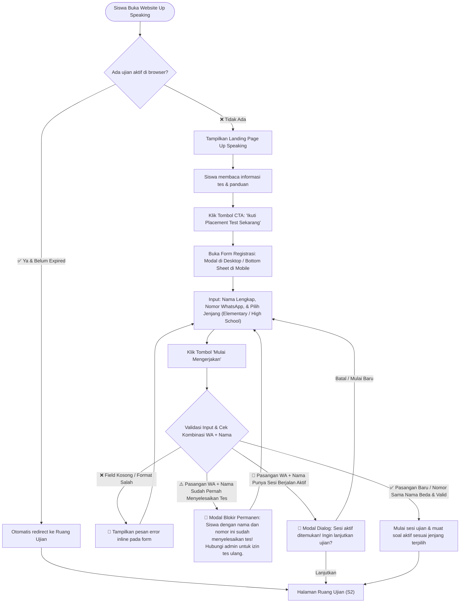
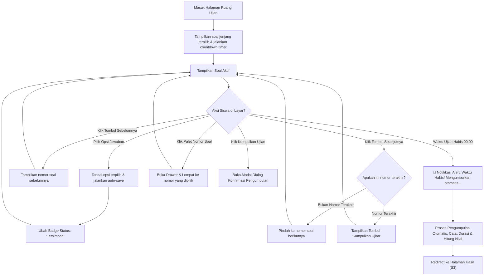
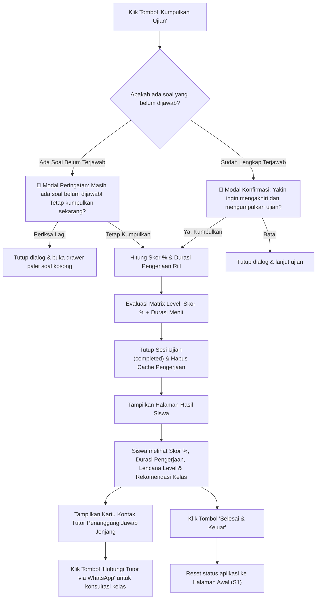
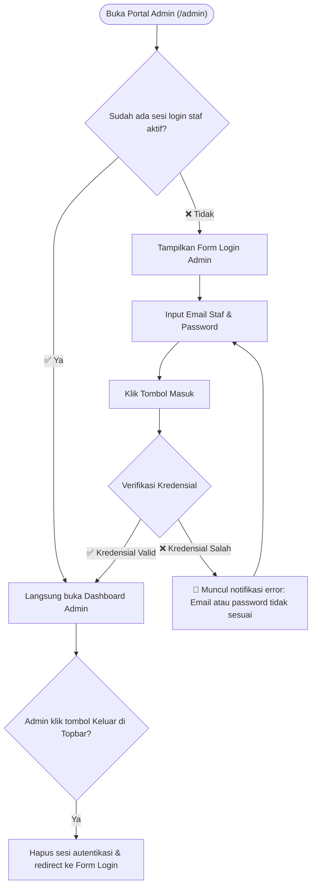
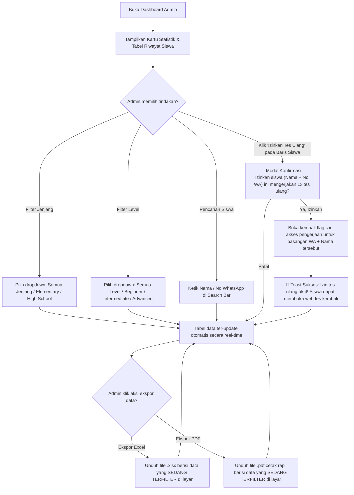
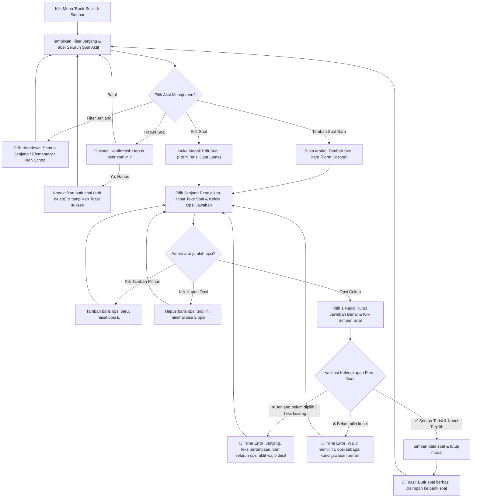
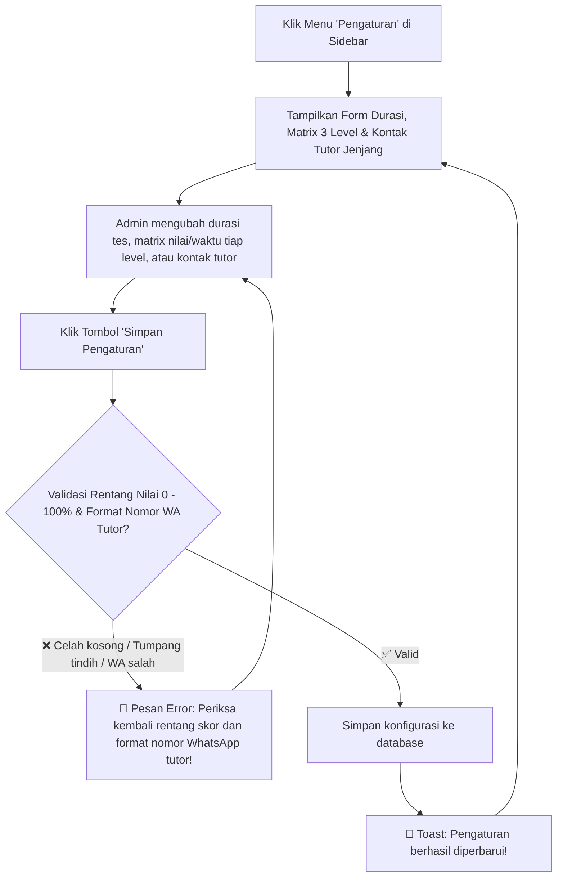
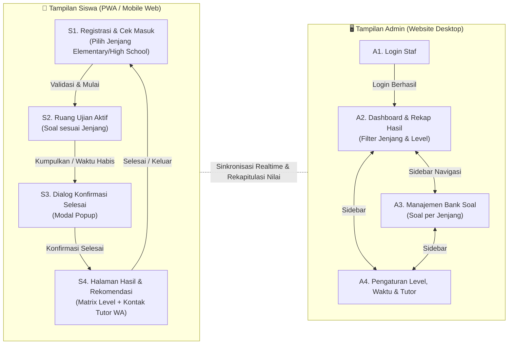

# UI Flow — Up Speaking Placement Test System
**Dokumen:** UI Flow & Screen Map Specification (Revised)  
**Referensi Utama:** [PRD.md](PRD.md)  
**Platform:** Web App / PWA (Mobile-Responsive untuk Siswa, Desktop-Optimized untuk Admin)  
**Versi:** 1.3.0  
**Tanggal Revisi:** 4 Oktober 2026  

> **Lingkup:** Dokumen ini hanya mengatur **alur, navigasi, dan perilaku komponen**. Detail visual (warna, tipografi, spacing, animasi) tidak ditetapkan di sini dan ditangani oleh skill desain per task.

---

## Daftar Isi

- [Konvensi Dokumen](#konvensi-dokumen)
- [A. Alur Siswa (Peserta Placement Test)](#a-alur-siswa-peserta-placement-test)
  - [S1. Alur Masuk & Pemulihan Sesi](#s1-alur-masuk--pemulihan-sesi)
  - [S2. Alur Pelaksanaan Ujian (Exam Room)](#s2-alur-pelaksanaan-ujian-exam-room)
  - [S3. Alur Pengumpulan & Tampilan Hasil (Result Screen)](#s3-alur-pengumpulan--tampilan-hasil-result-screen)
- [B. Alur Admin Panel (Staf Lembaga)](#b-alur-admin-panel-staf-lembaga)
  - [B1. Alur Autentikasi Admin](#b1-alur-autentikasi-admin)
  - [B2. Alur Dashboard & Rekapitulasi Hasil](#b2-alur-dashboard--rekapitulasi-hasil)
  - [B3. Alur Manajemen Bank Soal](#b3-alur-manajemen-bank-soal)
  - [B4. Alur Pengaturan Level, Durasi & Tutor](#b4-alur-pengaturan-level-durasi--tutor)
- [C. Peta Layar Lengkap (Sitemap)](#c-peta-layar-lengkap-sitemap)
- [D. Ringkasan Jumlah Layar](#d-ringkasan-jumlah-layar)

---

## Konvensi Dokumen

| Simbol | Arti |
|---|---|
| 🟦 Kotak | Layar / Halaman Web |
| 🔷 Berlian | Percabangan Logika / Pengecekan Sistem |
| ✅ | Kondisi Berhasil / Valid |
| ❌ | Kondisi Gagal / Error |
| ⚠️ | Kondisi Peringatan / Fraud Check |
| 🔔 | Modal Dialog / Pop-up Konfirmasi |
| ──> | Alur Navigasi / Aksi Pengguna |

---

## A. Alur Siswa (Peserta Placement Test)

### S1. Alur Masuk & Pemulihan Sesi

**Tujuan:** Menyajikan landing page resmi, membuka form registrasi (Nama, No WA, dan Jenjang Pendidikan), mendeteksi pemulihan sesi aktif, serta memvalidasi fraud check permanen berbasis kombinasi unik No WA + Nama.

**Catatan Komponen Layar (S1 - Landing Page & Modal Registrasi):**

1. **Struktur Halaman Utama (Landing Page):**
   * **Header / Navbar:** Logo resmi Up Speaking Learning Centre, tagline *"English Placement Test"*, dan tautan bantuan/kontak.
   * **Hero Section:**
     * Headline: *"Ukur Kemampuan Bahasa Inggrismu & Temukan Level Terbaikmu"*.
     * Subheadline: Penjelasan singkat tujuan tes penempatan resmi untuk pemetaan kelas belajar yang akurat.
     * **Tombol CTA Utama:** *"Ikuti Placement Test Sekarang"* (posisi strategis di hero, menjadi aksi utama halaman).
   * **Kartu Informasi Cepat (3 Fitur Kunci):**
     * **Durasi Ujian:** Batas waktu pengerjaan otomatis.
     * **Format Tes:** Pilihan ganda interaktif sesuai jenjang (Elementary / High School) dengan pengacakan Fisher-Yates.
     * **Hasil Instan:** Langsung mengetahui lencana level (Beginner, Intermediate, Advanced) dan kontak tutor pembimbing.
   * **Kartu Panduan & Ketentuan:**
     * 1. Kerjakan secara mandiri & jujur tanpa alat bantu agar rekomendasi kelas sesuai kemampuan riil.
     * 2. Jawaban tersimpan otomatis secara berkala.
     * 3. Satu nama siswa berlaku untuk 1x kesempatan tes resmi (orang tua dapat mendaftarkan anak lain menggunakan nomor WA yang sama).
   * **Footer:** Hak cipta Up Speaking Learning Centre & tautan bantuan admin.

2. **Komponen Form Registrasi (Pop-up Modal / Bottom Sheet):**
   * Tampil melayang saat tombol CTA diklik (Modal di tengah pada desktop, Bottom Sheet di mobile).
   * Judul: *"Data Peserta Placement Test"*.
   * Subtitle: *"Isi identitas dan pilih jenjang pendidikan Anda untuk memulai pengerjaan tes."*
   * Form Input:
     1. `Input Text`: Nama Lengkap Siswa (placeholder: *Contoh: Budi Pratama*).
     2. `Input Tel`: Nomor WhatsApp (placeholder: *Contoh: 08123456789*, deteksi format otomatis).
     3. `Pilihan Jenjang Pendidikan`: Radio Card / Pilihan Tunggal:
        * **Elementary:** Siswa usia SD / anak-anak.
        * **High School:** Siswa SMP, SMA, & Dewasa / Umum.
   * Tombol Aksi: *"Mulai Mengerjakan"* (dengan indikator loading saat tombol ditekan).
   * Tombol Tutup (✕) di pojok modal jika siswa ingin kembali membaca landing page.

---

### S2. Alur Pelaksanaan Ujian (Exam Room)

**Tujuan:** Ruang interaktif pengerjaan soal sesuai jenjang pendidikan dengan pengacakan Fisher-Yates, penghitung waktu mundur, pencatatan durasi riil, penyimpanan jawaban otomatis, dan navigasi daftar soal yang intuitif.

**Catatan Komponen Layar (S2 - Exam Screen):**
- **Sticky Top Bar:**
  - Nama siswa yang sedang aktif beserta label jenjang (`Elementary` / `High School`).
  - **Countdown Timer:** Menampilkan sisa waktu (MM:SS). Saat sisa waktu `< 05:00`, timer beralih ke tampilan peringatan.
  - **Auto-save Badge:** Indikator *"Tersimpan"* setiap siswa memilih opsi jawaban.
- **Area Pertanyaan (Content Body):**
  - Indikator nomor (misal: "Pertanyaan 12 dari 30").
  - Teks stimulus / pertanyaan soal berbahasa Inggris.
  - Opsi jawaban disajikan dalam bentuk **kartu pilihan interaktif** yang mudah di-*tap* pada layar ponsel dan menandai opsi terpilih dengan jelas.
- **Bottom Navigation Bar (Fixed Bottom):**
  - Tombol *"Sebelumnya"* (tombol sekunder, nonaktif di soal nomor 1).
  - Tombol *"Daftar Soal"* (membuka panel modal/drawer kisi soal).
  - Tombol *"Selanjutnya"* / *"Kumpulkan Ujian"* (tombol berganti saat berada di nomor terakhir).
- **Drawer / Sheet Palet Soal:**
  - Grid nomor 1 sampai N.
  - Status nomor yang harus dapat dibedakan:
    - **Sudah terjawab.**
    - **Belum terjawab.**
    - **Sedang dibuka / aktif saat ini.**

---

### S3. Alur Pengumpulan & Tampilan Hasil (Result Screen)

**Tujuan:** Memvalidasi pengumpulan akhir, menghitung skor %, menghitung durasi pengerjaan riil, menentukan level berdasarkan matrix (skor + waktu), dan menampilkan saran kelas beserta kontak tutor penanggung jawab.

**Catatan Komponen Layar (S3 - Result Screen):**
- **Hero Card Hasil:** Ilustrasi pencapaian, nama lengkap peserta, jenjang pendidikan, dan tanggal tes.
- **Metrik Pencapaian:**
  - Skor Persentase Besar (contoh: **`85%`**).
  - Rincian jumlah benar: (contoh: **`25 dari 30 Soal Benar`**).
  - **Durasi Pengerjaan Riil:** (contoh: **`Selesai dalam 18 Menit`**).
- **Lencana Level Belajar (*Level Badge*):**
  - Badge tingkat level: **Beginner / Intermediate / Advanced** (hasil evaluasi matrix skor + waktu).
  - Rekomendasi kelas belajar (contoh: *Kelas Elementary - Intermediate*).
- **Kartu Kontak Tutor Penanggung Jawab:**
  - Nama tutor penanggung jawab sesuai jenjang (Elementary / High School).
  - Tombol aksi: *"Hubungi Tutor via WhatsApp"* (membuka chat WA langsung dengan pesan pembuka otomatis berisi nama siswa, jenjang, skor, dan level).
- **Tombol Selesai:** Tombol *"Selesai & Keluar"* yang membersihkan sesi lokal browser agar perangkat siap digunakan oleh calon siswa berikutnya.

---

## B. Alur Admin Panel (Staf Lembaga)

### B1. Alur Autentikasi Admin

**Catatan Komponen Layar (B1 - Login Page):**
- Logo resmi Up Speaking Learning Centre.
- Judul: *"Portal Administrator Placement Test"*.
- Input Field: Email dan Password (dengan toggle *Show/Hide Password*).
- Tombol CTA: *"Masuk ke Dashboard"*.

---

### B2. Alur Dashboard & Rekapitulasi Hasil

**Tujuan:** Memantau metrik pencapaian peserta secara real-time, menyaring data berdasarkan level dan jenjang, memberikan izin tes ulang permanen, dan mengekspor riwayat nilai.

**Catatan Komponen Layar (B2 - Dashboard):**
- **Sidebar Navigasi:** Menu Dashboard (Aktif), Bank Soal, Pengaturan Tes, dan Tombol Keluar.
- **Kartu Ringkasan (Top Metrics):**
  - Total Siswa Mengikuti Tes.
  - Jumlah Siswa Level Beginner.
  - Jumlah Siswa Level Intermediate.
  - Jumlah Siswa Level Advanced.
- **Toolbar Tabel & Filter:**
  - Search bar interaktif (Cari Nama atau Nomor WhatsApp).
  - Dropdown Filter Jenjang (*Semua Jenjang, Elementary, High School*).
  - Dropdown Filter Level (*Semua Level, Beginner, Intermediate, Advanced*).
  - Tombol Ekspor Fleksibel: *"Ekspor PDF"* dan *"Ekspor Excel"* (data yang diekspor otomatis mengikuti filter aktif).
- **Tabel Data Hasil:**
  - Kolom: No, Tanggal/Waktu Tes, Nama Lengkap Siswa, Nomor WhatsApp, **Jenjang**, **Durasi (Menit)**, Benar/Total, Skor (%), Badge Level, dan **Aksi**.
  - **Aksi Cepat per Siswa:** Tombol *"Izinkan Tes Ulang"* (ikon refresh). Ketika diklik, membuka modal konfirmasi untuk memberikan izin 1x tes baru kepada pasangan Nomor WhatsApp dan Nama Siswa bersangkutan tanpa menghapus riwayat nilai lamanya.

---

### B3. Alur Manajemen Bank Soal

**Tujuan:** Mengelola butir soal pilihan ganda per jenjang pendidikan dengan opsi jawaban dinamis dan validasi kelengkapan data.

**Catatan Komponen Layar (B3 - Bank Soal):**
- **Header:** Indikator total soal aktif, dropdown filter jenjang, dan tombol aksi *"Tambah Soal Baru"*.
- **Tabel Butir Soal:** Kolom nomor urut, **Jenjang Pendidikan**, potongan teks pertanyaan, jumlah opsi, kunci jawaban benar, status aktif, dan tombol aksi (Edit & Hapus).
- **Modal Form Tambah / Edit Soal:**
  - Dropdown / Radio Pilihan: **Jenjang Pendidikan** (`Elementary` / `High School`).
  - Textarea: *Teks Pertanyaan / Soal* (wajib diisi).
  - **Daftar Pilihan Jawaban Dinamis (*Flexible Options*):**
    - Default awal: 4 baris input (Opsi A, B, C, D).
    - Tombol *"+ Tambah Pilihan"* untuk menambah baris opsi baru (misal opsi E).
    - Ikon Hapus (🗑️) di setiap baris opsi untuk mengurangi pilihan (batas minimal 2 opsi).
    - Radio Button Group: Terintegrasi di samping setiap baris opsi untuk memilih 1 kunci jawaban benar.
  - Tombol *Simpan* akan mengecek validasi form sebelum mengirim data.
  - Tombol Batal untuk menutup modal tanpa menyimpan perubahan.

---

### B4. Alur Pengaturan Level, Durasi & Tutor

**Tujuan:** Mengatur durasi pengerjaan tes, matrix penilaian level (skor % dan batas waktu), serta kontak tutor penanggung jawab per jenjang.

**Catatan Komponen Layar (B4 - Settings Page):**
- **Pengaturan Waktu Ujian:** Input angka durasi tes utama dalam satuan menit (default: 45 menit).
- **Pengaturan Matrix Level (3 Tingkat):**
  - **Level 1 (Beginner):** Rentang skor % min-max, batas waktu menit, dan teks saran kelas.
  - **Level 2 (Intermediate):** Rentang skor % min-max, batas waktu menit, dan teks saran kelas.
  - **Level 3 (Advanced):** Rentang skor % min-max, batas waktu menit, dan teks saran kelas.
- **Pengaturan Kontak Tutor Penanggung Jawab:**
  - **Tutor Elementary:** Input Nama Lengkap & Nomor WhatsApp.
  - **Tutor High School:** Input Nama Lengkap & Nomor WhatsApp.
- **Tombol Simpan:** *"Simpan Pengaturan"*.

---

## C. Peta Layar Lengkap (Sitemap)

Arsitektur navigasi antarmuka aplikasi Up Speaking Placement Test:

---

## D. Ringkasan Jumlah Layar

| Area | Kode | Nama Layar | Tipe Tampilan | Karakteristik Utama |
|---|---|---|---|---|
| **Siswa** | S1 | Landing Page & Registrasi | Halaman Penuh + Modal/Sheet | Landing page resmi, highlight info tes, & modal registrasi (Nama, WA, Jenjang) |
| **Siswa** | S2 | Ruang Ujian (Exam Room) | Halaman Penuh | Soal sesuai jenjang, timer dinamis, auto-save status, drawer palet soal |
| **Siswa** | S3 | Dialog Konfirmasi Submit | Modal Pop-up Dialog | Peringatan jika ada soal yang belum terjawab sebelum submit |
| **Siswa** | S4 | Hasil Level & Rekomendasi | Halaman Penuh | Skor %, durasi riil, badge matrix level, rekomendasi kelas, kontak tutor WA |
| **Admin** | A1 | Autentikasi Admin (Login) | Halaman Penuh | Form login staf lembaga |
| **Admin** | A2 | Dashboard Rekap Nilai | Halaman Penuh (Sidebar + Table) | Kartu ringkasan, filter jenjang & level, kolom durasi, ekspor PDF/Excel, izin tes ulang |
| **Admin** | A3 | Manajemen Bank Soal | Halaman Penuh (Sidebar + Modal) | Filter & tag jenjang, opsi dinamis (+ Tambah Opsi / Hapus), validasi kunci |
| **Admin** | A4 | Pengaturan Level, Waktu & Tutor | Halaman Penuh (Sidebar + Form) | Durasi menit, matrix level (skor + waktu), kontak tutor per jenjang |
