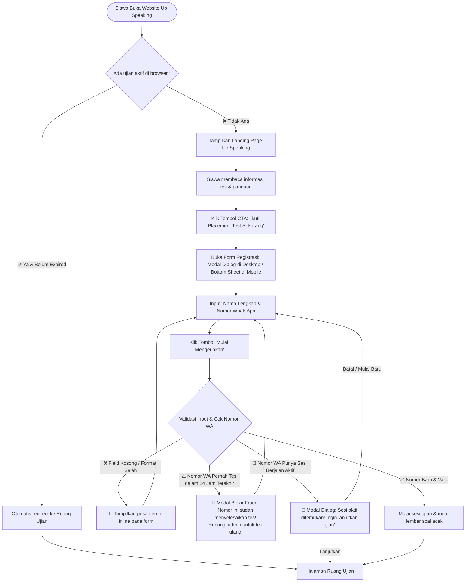
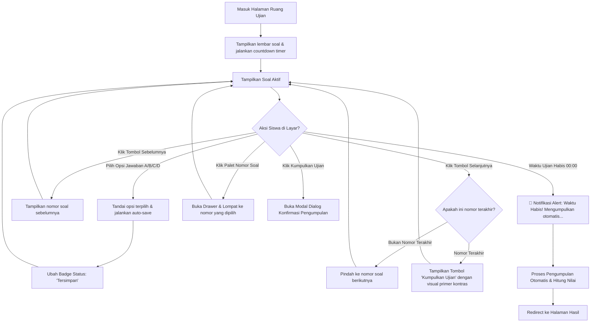
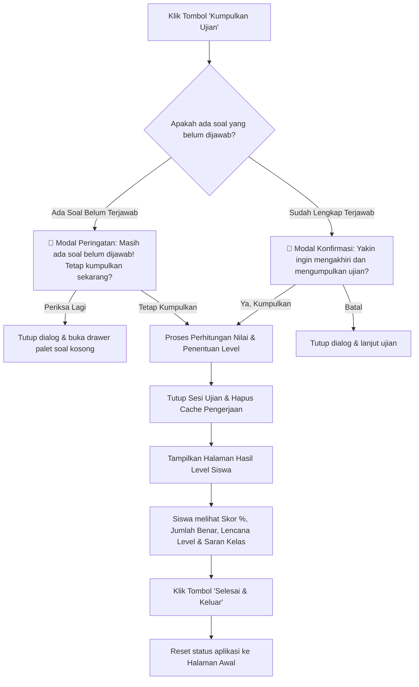
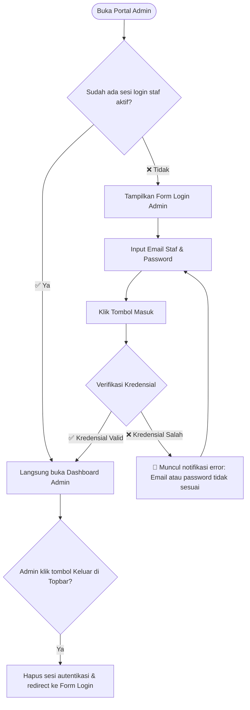
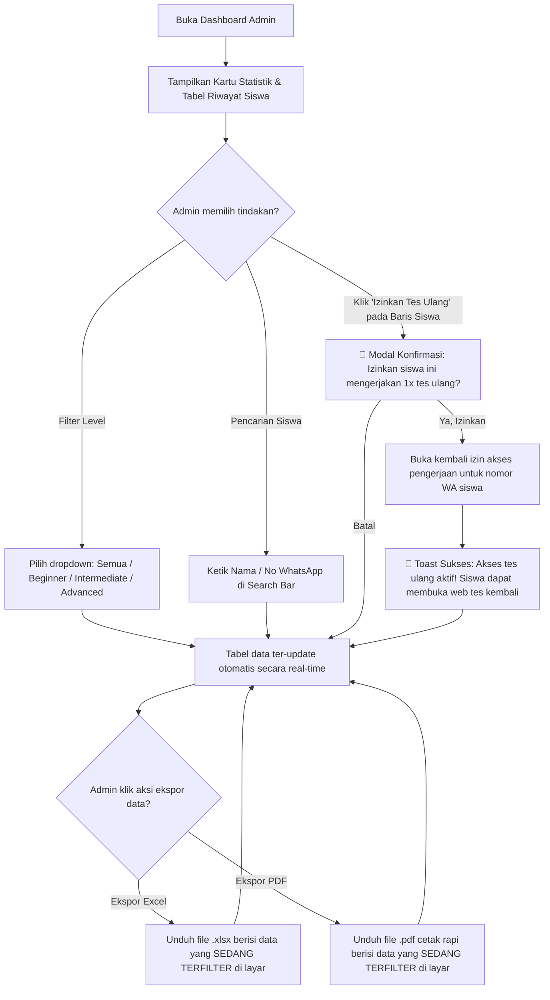
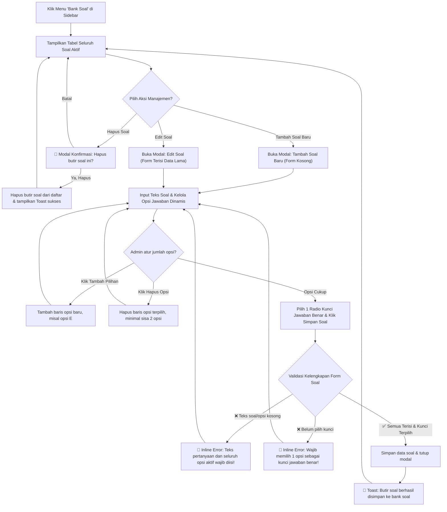
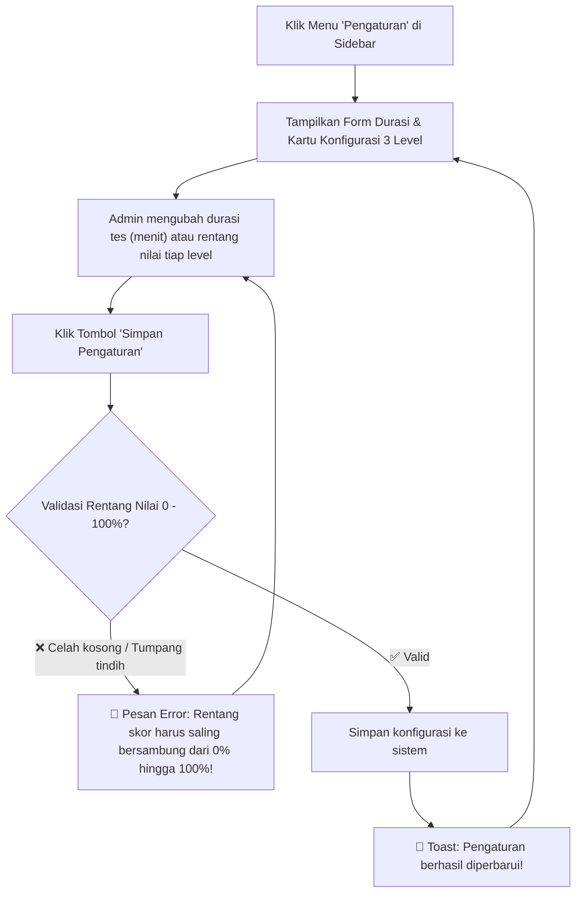
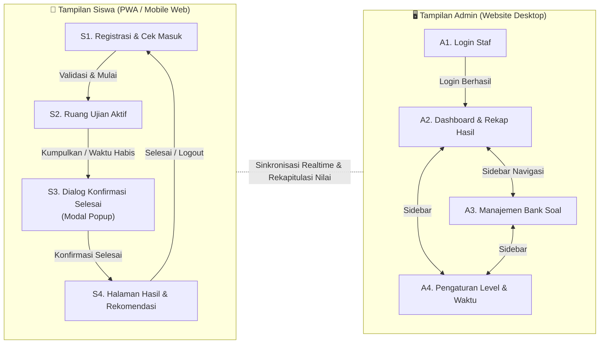

# UI Flow — Up Speaking Placement Test System
**Dokumen:** UI Flow & Screen Map Specification (Revised)  
**Referensi Utama:** PRD Up Speaking Placement Test  
**Platform:** Web App / PWA (Mobile-Responsive untuk Siswa, Desktop-Optimized untuk Admin)  
**Versi:** 1.1.0  
**Tanggal Revisi:** 30 September 2026  

---

## Daftar Isi

- [Konvensi Dokumen](#konvensi-dokumen)
- [Design Tokens & Panduan Visual (Design System Foundation)](#design-tokens--panduan-visual-design-system-foundation)
- [A. Alur Siswa (Peserta Placement Test)](#a-alur-siswa-peserta-placement-test)
  - [S1. Alur Masuk & Pemulihan Sesi (Anti-Close & Anti-Cheat Fraud Check)](#s1-alur-masuk--pemulihan-sesi-anti-close--anti-cheat-fraud-check)
  - [S2. Alur Pelaksanaan Ujian (Exam Room)](#s2-alur-pelaksanaan-ujian-exam-room)
  - [S3. Alur Pengumpulan & Tampilan Hasil (Result Screen)](#s3-alur-pengumpulan--tampilan-hasil-result-screen)
- [B. Alur Admin Panel (Staf Lembaga)](#b-alur-admin-panel-staf-lembaga)
  - [B1. Alur Autentikasi Admin](#b1-alur-autentikasi-admin)
  - [B2. Alur Dashboard & Rekapitulasi Hasil](#b2-alur-dashboard--rekapitulasi-hasil)
  - [B3. Alur Manajemen Bank Soal (Dengan Validasi Ketat Form)](#b3-alur-manajemen-bank-soal-dengan-validasi-ketat-form)
  - [B4. Alur Pengaturan Level & Durasi Tes](#b4-alur-pengaturan-level--durasi-tes)
- [C. Peta Layar Lengkap (Sitemap)](#c-peta-layar-lengkap-sitemap)

---

## Konvensi Dokumen

| Simbol | Arti |
|---|---|
| 🟦 Kotak | Layar / Halaman Web |
| 🔷 Berlian | Percabangan Logika / Pengecekan Sistem |
| ✅ | Kondisi Berhasil / Valid |
| ❌ | Kondisi Gagal / Error |
| ⚠️ | Kondisi Peringatan / Fraud Check |
| 🔔 | Modal Dialog / Pop-up Konfirmasi |
| ──> | Alur Navigasi / Aksi Pengguna |

---

## Design Tokens & Panduan Visual (Design System Foundation)

Untuk menjamin konsistensi antarmuka antara sisi Siswa (Mobile/PWA) dan Admin (Desktop), sistem menggunakan hierarki visual: **Modern EdTech — Friendly, Approachable & Academic Focus**, yang diselaraskan secara langsung dengan logo resmi Up Speaking ("UP"):

| Kategori Token | Nilai / Deskripsi | Penggunaan Antarmuka & Relevansi Brand |
|---|---|---|
| **Primary Brand** | `#0f2e60` s.d. `#1e3a8a` (Deep Academic Navy) | Header siswa, topbar admin, tipografi judul, struktur utama |
| **Brand Cyan / U-Blue** | `#0284c7` s.d. `#0ea5e9` (Up Sky Blue) | Selaras huruf "U" pada logo: badge kategori, link bantuan, status aktif |
| **Brand Scarlet / P-Red** | `#e11d48` s.d. `#e53935` (Up Coral Red) | Selaras huruf "P" pada logo: tombol CTA utama ("Mulai Tes"), timer alert |
| **Success Color** | `#059669` (Emerald Green) | Jawaban tersimpan otomatis, status soal terjawab, skor penempatan |
| **Warning / Alert** | `#dc2626` (Crimson Alert) | Peringatan soal kosong, notifikasi nomor terdaftar (fraud prevention) |
| **Neutral Surface** | `#F8FAFC` & `#FFFFFF` | Background kanvas bersih, kartu fitur, kartu soal, tabel admin |
| **Typography** | `Plus Jakarta Sans`, `Inter`, sans-serif | Tipografi sans modern berkarakter ramah dengan legibilitas tinggi |

---

## A. Alur Siswa (Peserta Placement Test)

### S1. Alur Landing Page, Registrasi Peserta & Pemulihan Sesi

**Tujuan:** Menyajikan halaman pembuka resmi (*Landing Page*) yang informatif dan elegan, membuka form registrasi via Modal/Bottom Sheet saat CTA diklik, serta mendeteksi pemulihan sesi ujian otomatis jika browser sempat tertutup.

**Catatan Komponen Layar (S1 - Landing Page & Modal Registrasi):**

1. **Struktur Halaman Utama (Landing Page):**
   * **Header / Navbar:** Logo resmi Up Speaking Learning Centre, tagline *"English Placement Test"*, dan tautan bantuan/kontak.
   * **Hero Section:**
     * Headline: *"Ukur Kemampuan Bahasa Inggrismu & Temukan Level Terbaikmu"*.
     * Subheadline: Penjelasan singkat tujuan tes penempatan resmi untuk pemetaan kelas belajar yang akurat.
     * **Tombol CTA Utama:** *"Ikuti Placement Test Sekarang 👉"* (ukuran besar, warna aksen Amber menyala, posisi strategis di hero).
   * **Kartu Informasi Cepat (3 Fitur Kunci):**
     * ⏱️ **Durasi Ujian:** ~45 Menit (penghitung waktu mundur otomatis).
     * 📝 **Format Tes:** Pilihan ganda interaktif dengan pengacakan soal.
     * 🎯 **Hasil Instan:** Langsung mengetahui lencana level (Beginner, Intermediate, Advanced).
   * **Kartu Panduan & Ketentuan:**
     * 1. Kerjakan secara mandiri & jujur tanpa alat bantu agar rekomendasi kelas sesuai kemampuan riil.
     * 2. Jawaban tersimpan otomatis secara berkala.
     * 3. Satu nomor WhatsApp berlaku untuk 1x kesempatan tes resmi.
   * **Footer:** Hak cipta Up Speaking Learning Centre & tautan bantuan admin.

2. **Komponen Form Registrasi (Pop-up Modal / Bottom Sheet):**
   * Tampil melayang saat tombol CTA diklik (Modal di tengah pada desktop, Bottom Sheet geser dari bawah pada mobile).
   * Judul: *"Data Peserta Placement Test"*.
   * Subtitle: *"Isi nama dan nomor WhatsApp Anda untuk memulai pengerjaan tes."*
   * Form Input:
     1. `Input Text`: Nama Lengkap (placeholder: *Contoh: Budi Pratama*).
     2. `Input Tel`: Nomor WhatsApp (placeholder: *Contoh: 08123456789*, deteksi format otomatis).
   * Tombol Aksi: *"Mulai Mengerjakan"* (dengan indikator loading saat tombol ditekan).
   * Tombol Tutup (✕) di pojok modal jika siswa ingin kembali membaca landing page.

---

### S2. Alur Pelaksanaan Ujian (Exam Room)

**Tujuan:** Ruang interaktif pengerjaan soal dengan pengacakan, penghitung waktu mundur, penyimpanan jawaban otomatis, dan navigasi daftar soal yang intuitif.

**Catatan Komponen Layar (S2 - Exam Screen):**
- **Sticky Top Bar:**
  - Nama siswa yang sedang aktif.
  - **Countdown Timer:** Menampilkan sisa waktu (MM:SS). Saat sisa waktu `< 05:00`, timer berubah menjadi warna merah dengan animasi denyut pelan (*subtle pulse*).
  - **Auto-save Badge:** Indikator visual hijau *"Tersimpan"* setiap siswa memilih opsi jawaban.
- **Area Pertanyaan (Content Body):**
  - Indikator nomor (misal: "Pertanyaan 12 dari 30").
  - Teks stimulus / pertanyaan soal berbahasa Inggris.
  - Opsi jawaban (A, B, C, D) disajikan dalam bentuk **Interactive Radio Cards** (memiliki efek seleksi warna tegas, mudah di-*tap* pada layar ponsel).
- **Bottom Navigation Bar (Fixed Bottom):**
  - Tombol *"Sebelumnya"* (tombol sekunder, nonaktif di soal nomor 1).
  - Tombol *"Daftar Soal"* (membuka panel modal/drawer kisi soal).
  - Tombol *"Selanjutnya"* / *"Kumpulkan Ujian"* (memiliki warna kontras berbeda saat berada di nomor terakhir).
- **Drawer / Sheet Palet Soal:**
  - Grid nomor 1 sampai N.
  - Indikator status warna:
    - 🟢 **Hijau:** Sudah terjawab.
    - ⚪ **Abu-abu:** Belum terjawab.
    - 🔵 **Biru Ring:** Sedang dibuka / aktif saat ini.

---

### S3. Alur Pengumpulan & Tampilan Hasil (Result Screen)

**Layar yang Terlibat:** Modal Konfirmasi Submit → Halaman Hasil Level

**Catatan Komponen Layar (S3 - Result Screen):**
- **Hero Card Hasil:** Ilustrasi pencapaian, nama lengkap peserta, dan tanggal tes.
- **Metrik Pencapaian:**
  - Skor Persentase Besar (contoh: **`78%`**).
  - Rincian jumlah benar: (contoh: **`23 dari 30 Soal Benar`**).
- **Lencana Level Belajar (*Level Badge*):**
  - Badge tingkat level: **Beginner / Intermediate / Advanced**.
  - Kotak rekomendasi kelas & kurikulum belajar yang paling cocok.
- **Tombol Selesai:** Tombol *"Selesai & Keluar"* yang membersihkan sesi lokal browser agar perangkat siap digunakan oleh calon siswa berikutnya.

---

## B. Alur Admin Panel (Staf Lembaga)

### B1. Alur Autentikasi Admin

**Catatan Komponen Layar (B1 - Login Page):**
- Logo resmi Up Speaking Learning Centre.
- Judul: *"Portal Administrator Placement Test"*.
- Input Field: Email dan Password (dengan toggle *Show/Hide Password*).
- Tombol CTA: *"Masuk ke Dashboard"*.

---

### B2. Alur Dashboard & Rekapitulasi Hasil

**Tujuan:** Memantau metrik pencapaian peserta secara real-time dan mengekspor riwayat nilai.

**Catatan Komponen Layar (B2 - Dashboard):**
- **Sidebar Navigasi:** Menu Dashboard (Aktif), Bank Soal, Pengaturan Tes, dan Tombol Keluar.
- **Kartu Ringkasan (Top Metrics):**
  - Total Siswa Mengikuti Tes.
  - Jumlah Siswa Level Beginner.
  - Jumlah Siswa Level Intermediate.
  - Jumlah Siswa Level Advanced.
- **Toolbar Tabel & Filter:**
  - Search bar interaktif (Cari Nama atau Nomor WhatsApp).
  - Dropdown Filter Level (*Semua Level, Beginner, Intermediate, Advanced*).
  - Tombol Ekspor Fleksibel: *"Ekspor PDF"* dan *"Ekspor Excel"* (data yang diekspor otomatis mengikuti filter aktif).
- **Tabel Data Hasil:**
  - Kolom: No, Tanggal/Waktu Tes, Nama Lengkap Siswa, Nomor WhatsApp, Benar/Total, Skor (%), Badge Level, dan **Aksi**.
  - **Aksi Cepat per Siswa:** Tombol *"Izinkan Tes Ulang"* (ikon putar/refresh). Ketika diklik, membuka modal konfirmasi untuk memberikan izin 1x tes baru kepada nomor WhatsApp yang bersangkutan tanpa menghapus riwayat nilai lamanya.

---

### B3. Alur Manajemen Bank Soal (Dengan Opsi Jawaban Dinamis & Validasi Ketat)

**Tujuan:** Mengelola daftar butir soal pilihan ganda dengan fleksibilitas jumlah opsi jawaban per soal (dinamis) dan validasi kelengkapan data.

**Catatan Komponen Layar (B3 - Bank Soal):**
- **Header:** Indikator total soal aktif & tombol aksi *"Tambah Soal Baru"*.
- **Tabel Butir Soal:** Kolom nomor urut, potongan teks pertanyaan, jumlah opsi, kunci jawaban benar, status aktif, dan tombol aksi (Edit & Hapus).
- **Modal Form Tambah / Edit Soal (Opsi Dinamis & Validasi Ketat):**
  - Textarea: *Teks Pertanyaan / Soal* (wajib diisi).
  - **Daftar Pilihan Jawaban Dinamis (*Flexible Options*):**
    - Default awal: 4 baris input (Opsi A, B, C, D).
    - Tombol *"+ Tambah Pilihan"* untuk menambah baris opsi baru (misal jika ingin 5 opsi A s.d. E).
    - Ikon Hapus (🗑️) di setiap baris opsi untuk mengurangi pilihan (batas minimal 2 opsi).
    - Radio Button Group: Terintegrasi di samping setiap baris opsi untuk memilih 1 kunci jawaban benar (otomatis sinkron dengan opsi yang ada).
  - Tombol *Simpan* akan mengecek validasi form sebelum mengirim data.
  - Tombol Batal untuk menutup modal tanpa menyimpan perubahan.

---

### B4. Alur Pengaturan Level & Durasi Tes

**Tujuan:** Mengatur durasi pengerjaan tes serta rentang persentase untuk masing-masing level kemampuan.

**Catatan Komponen Layar (B4 - Settings Page):**
- **Pengaturan Waktu:** Input angka durasi tes dalam satuan menit (default: 45 menit).
- **Pengaturan Rentang Level (3 Tingkat):**
  - **Level 1 (Beginner):** Rentang nilai minimum s.d. maksimum (%) + Teks saran kelas.
  - **Level 2 (Intermediate):** Rentang nilai minimum s.d. maksimum (%) + Teks saran kelas.
  - **Level 3 (Advanced):** Rentang nilai minimum s.d. maksimum (%) + Teks saran kelas.
- **Tombol Simpan:** *"Simpan Pengaturan"*.

---

## C. Peta Layar Lengkap (Sitemap)

Arsitektur navigasi antarmuka aplikasi Up Speaking Placement Test:

---

### Ringkasan Jumlah Layar (Spesifikasi Final)

| Area | Nama Layar | Tipe Tampilan | Karakteristik Utama |
|---|---|---|---|
| **Siswa** | Landing Page & Registrasi | Halaman Penuh + Modal/Sheet | Landing page resmi, highlight info tes, & modal registrasi nama/WA |
| **Siswa** | Ruang Ujian (Exam Room) | Halaman Penuh | Timer countdown dinamis, auto-save status, drawer palet soal |
| **Siswa** | Dialog Konfirmasi Submit | Modal Pop-up Dialog | Peringatan jika ada soal yang belum terjawab |
| **Siswa** | Hasil Level & Rekomendasi | Halaman Penuh | Skor persentase, total benar, badge level, tombol reset sesi |
| **Admin** | Autentikasi Admin (Login) | Halaman Penuh | Form login staf lembaga |
| **Admin** | Dashboard Rekap Nilai | Halaman Penuh (Sidebar + Table) | Kartu ringkasan level, filter dinamis, ekspor PDF/Excel tersaring, & tombol izin tes ulang |
| **Admin** | Manajemen Bank Soal | Halaman Penuh (Sidebar + Modal) | Opsi jawaban dinamis (+ Tambah Opsi / Hapus) & validasi kunci |
| **Admin** | Pengaturan Level & Waktu | Halaman Penuh (Sidebar + Form) | Konfigurasi durasi menit & rentang 0-100% terpadu |
