# UI Flow — Up Speaking Placement Test System
**Dokumen:** UI Flow & Screen Map Specification  
**Referensi Utama:** [PRD.md](PRD.md)  
**Platform:** Web App / Progressive Web App (PWA)  
**Versi:** 2.0.0  
**Tanggal Revisi:** 5 Oktober 2026  

> **Lingkup:** Dokumen ini hanya mengatur **alur, navigasi, dan perilaku komponen**. Detail visual (warna, tipografi, spacing, animasi) tidak ditetapkan di sini dan ditangani oleh skill desain per task.

---

## Daftar Isi

- [Konvensi Dokumen](#konvensi-dokumen)
- [A. Alur Siswa (Peserta Placement Test)](#a-alur-siswa-peserta-placement-test)
  - [S1. Alur Masuk & Verifikasi Registrasi](#s1-alur-masuk--verifikasi-registrasi)
  - [S2. Alur Pelaksanaan Ujian (Exam Room)](#s2-alur-pelaksanaan-ujian-exam-room)
  - [S3. Alur Konfirmasi Pengumpulan](#s3-alur-konfirmasi-pengumpulan)
  - [S4. Alur Tampilan Hasil & Apresiasi](#s4-alur-tampilan-hasil--apresiasi)
- [B. Alur Admin (Staf Meja Pendaftaran & Administrasi)](#b-alur-admin-staf-meja-pendaftaran--administrasi)
  - [A1. Alur Autentikasi Admin](#a1-alur-autentikasi-admin)
  - [A2. Alur Pendaftaran Siswa Baru (On-Desk Registration)](#a2-alur-pendaftaran-siswa-baru-on-desk-registration)
  - [A3. Alur Dashboard Rekapitulasi & Retest](#a3-alur-dashboard-rekapitulasi--retest)
  - [A4. Alur Manajemen Bank Soal](#a4-alur-manajemen-bank-soal)
  - [A5. Alur Pengaturan Kontak Tutor](#a5-alur-pengaturan-kontak-tutor)
- [C. Alur Tutor (Evaluator Akademik Jenjang)](#c-alur-tutor-evaluator-akademik-jenjang)
  - [T1. Alur Autentikasi Tutor](#t1-alur-autentikasi-tutor)
  - [T2. Alur Antrean Evaluasi Siswa](#t2-alur-antrean-evaluasi-siswa)
  - [T3. Alur Penetapan Level Resmi](#t3-alur-penetapan-level-resmi)
- [D. Peta Layar Lengkap (Sitemap)](#d-peta-layar-lengkap-sitemap)
- [E. Ringkasan Jumlah Layar](#e-ringkasan-jumlah-layar)

---

## Konvensi Dokumen

| Simbol | Arti |
|---|---|
| 🟦 Kotak | Layar / Halaman Web |
| 🔷 Berlian | Percabangan Logika / Pengecekan Sistem |
| ✅ | Kondisi Berhasil / Valid |
| ❌ | Kondisi Gagal / Error |
| ⚠️ | Kondisi Peringatan / Status Pengerjaan |
| 🔔 | Modal Dialog / Pop-up Konfirmasi |
| ──> | Alur Navigasi / Aksi Pengguna |

---

## A. Alur Siswa (Peserta Placement Test)

### S1. Alur Masuk & Verifikasi Registrasi

**Tujuan:** Menyajikan halaman masuk bagi siswa untuk menginput Nama Lengkap dan Nomor WhatsApp, memverifikasi status pendaftaran yang telah dibuat Admin, dan mengarahkan siswa ke ruang ujian.

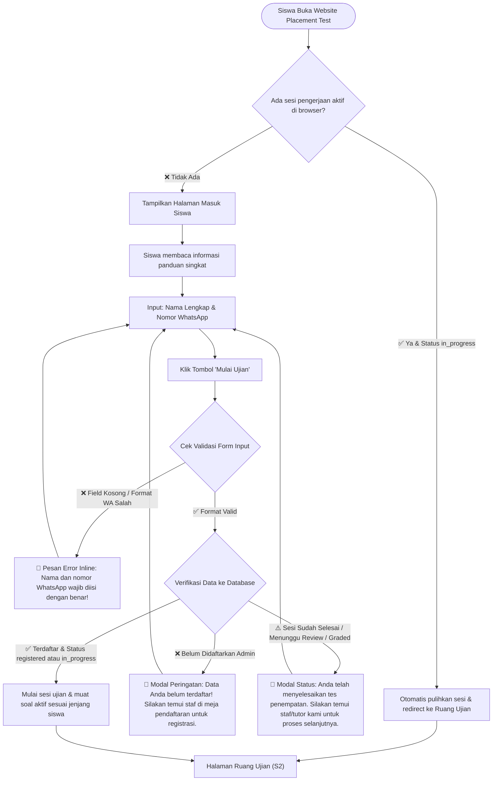

**Catatan Komponen Layar (S1 - Halaman Masuk):**
- **Header:** Logo resmi Up Speaking Learning Centre, judul *"English Placement Test"*.
- **Area Informasi & Panduan Singkat:**
  - Penjelasan tujuan tes penempatan kemampuan bahasa Inggris.
  - Panduan: Kerjakan secara mandiri, jawaban tersimpan otomatis, pengerjaan tanpa batasan waktu terburu-buru.
- **Form Masuk Siswa:**
  - `Input Text`: Nama Lengkap Siswa (placeholder: *Masukkan nama lengkap Anda*).
  - `Input Tel`: Nomor WhatsApp (placeholder: *Contoh: 08123456789*).
  - `Tombol Aksi`: *"Mulai Ujian"* (dengan indikator status loading saat pengiriman data).
- **Status / Alert Area:** Area pesan notifikasi untuk menampilkan pesan kesalahan jika data belum didaftarkan oleh Admin.

---

### S2. Alur Pelaksanaan Ujian (Exam Room)

**Tujuan:** Menyajikan butir soal pilihan ganda sesuai jenjang siswa dengan urutan dan opsi yang teracak secara dinamis, mencatat durasi riil di latar belakang, dan menyimpan setiap pilihan jawaban secara realtime.

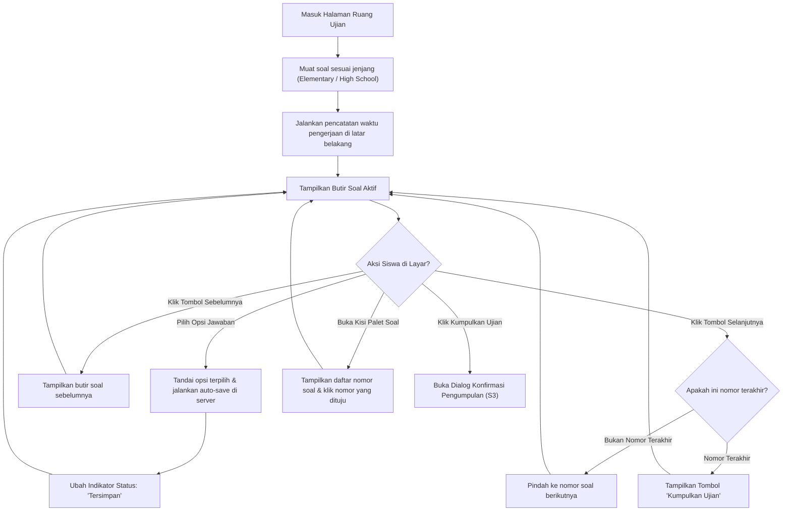

**Catatan Komponen Layar (S2 - Ruang Ujian):**
- **Header Ujian:**
  - Nama lengkap siswa dan label jenjang pendidikan (`Elementary` / `High School`).
  - Indikator waktu pengerjaan berjalan (menampilkan durasi waktu yang telah berjalan).
  - Indikator status penyimpanan: *"Tersimpan"* / *"Menyimpan..."*.
- **Area Pertanyaan:**
  - Penanda urutan (misal: "Pertanyaan 12 dari 30").
  - Teks pertanyaan / stimulus soal bahasa Inggris.
  - Kartu opsi pilihan jawaban interaktif (menampilkan teks opsi, mudah dipilih, dan menandai opsi aktif).
- **Navigasi Bawah:**
  - Tombol *"Sebelumnya"* (nonaktif pada nomor pertama).
  - Tombol *"Daftar Soal"* (membuka panel kisi nomor soal).
  - Tombol *"Selanjutnya"* / *"Kumpulkan Ujian"* (berganti pada nomor soal terakhir).
- **Panel Kisi Nomor Soal:**
  - Grid seluruh nomor soal.
  - Status nomor: Terjawab, Belum Terjawab, dan Sedang Dibuka.

---

### S3. Alur Konfirmasi Pengumpulan

**Tujuan:** Memvalidasi kelengkapan jawaban sebelum pengumpulan final dan memastikan siswa benar-benar ingin mengakhiri ujian.

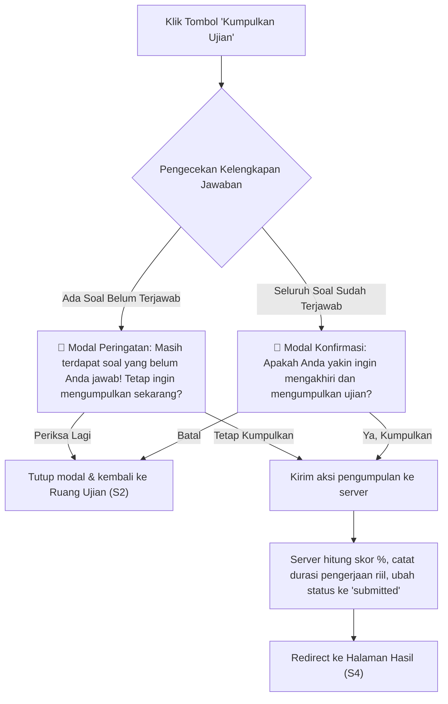

**Catatan Komponen Layar (S3 - Modal Konfirmasi):**
- **Judul Dialog:** *"Konfirmasi Pengumpulan Ujian"*.
- **Isi Pesan:** Informasi jumlah soal yang telah dijawab dari total keseluruhan.
- **Tombol Aksi:**
  - Tombol Batal: *"Periksa Kembali"* (menutup dialog).
  - Tombol Konfirmasi: *"Ya, Kumpulkan Ujian"* (memproses pengumpulan).

---

### S4. Alur Tampilan Hasil & Apresiasi

**Tujuan:** Menampilkan ucapan apresiasi atas penyelesaian tes, menyajikan ringkasan statistik performa objektif (skor % dan durasi pengerjaan), menampilkan lencana status evaluasi terbuka, serta menyediakan akses langsung ke kontak Tutor.

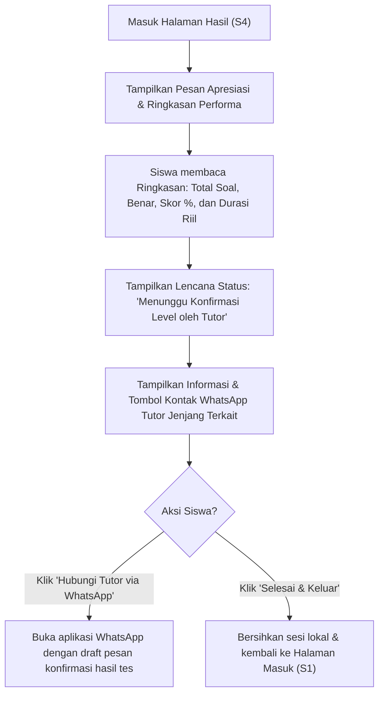

**Catatan Komponen Layar (S4 - Halaman Hasil):**
- **Header Apresiasi:** Ucapan terima kasih dan apresiasi ramah (*"Awesome Job, [Nama Siswa]! Tes penempatan berhasil dikumpulkan"*).
- **Kartu Ringkasan Performa:**
  - Total Soal dan Jumlah Terjawab (contoh: `30 / 30 Soal`).
  - Akurasi Jawaban & Skor Persentase (contoh: `24 Benar (80%)`).
  - Durasi Pengerjaan Aktual (contoh: `16 Menit`).
- **Area Status Evaluasi Tutor:**
  - Lencana status: *"Menunggu Konfirmasi Level oleh Tutor"*.
  - Pesan informasi: Penentuan level kelas definitif sedang ditinjau dan akan ditetapkan secara profesional oleh Tutor penanggung jawab.
- **Kartu Kontak Tutor Jenjang Terkait:**
  - Nama Tutor penanggung jawab jenjang siswa (Elementary / High School).
  - Tombol aksi: *"Hubungi Tutor via WhatsApp"*.
- **Tombol Selesai:** Tombol *"Selesai & Keluar"* untuk membersihkan sesi lokal perangkat.

---

## B. Alur Admin (Staf Meja Pendaftaran & Administrasi)

### A1. Alur Autentikasi Admin

**Tujuan:** Mengamankan akses staf administrasi lembaga melalui verifikasi email dan password.

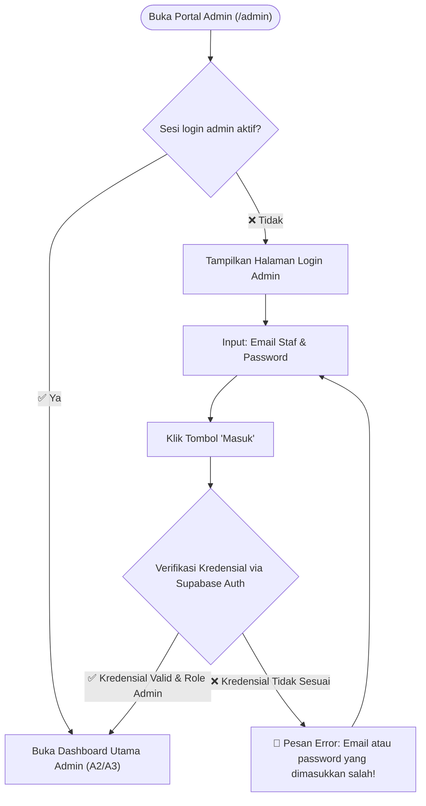

**Catatan Komponen Layar (A1 - Login Admin):**
- Logo resmi Up Speaking Learning Centre.
- Judul: *"Portal Administrator"*.
- Input Field: Email dan Password.
- Tombol Aksi: *"Masuk ke Dashboard"*.

---

### A2. Alur Pendaftaran Siswa Baru (On-Desk Registration)

**Tujuan:** Memfasilitasi staf meja pendaftaran untuk mendaftarkan calon siswa secara langsung dan menghasilkan sesi tes baru berstatus `registered`.

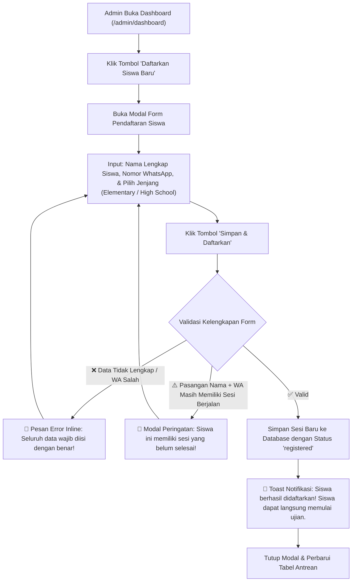

**Catatan Komponen Layar (A2 - Modal Registrasi Siswa):**
- **Judul Modal:** *"Pendaftaran Calon Siswa Baru"*.
- **Input Field:**
  - `Input Text`: Nama Lengkap Siswa.
  - `Input Tel`: Nomor WhatsApp Siswa / Orang Tua.
  - `Dropdown / Radio`: Pilihan Jenjang Pendidikan (`Elementary` / `High School`).
- **Tombol Aksi:**
  - Tombol Batal: *"Batal"*.
  - Tombol Simpan: *"Simpan & Daftarkan"*.

---

### A3. Alur Dashboard Rekapitulasi & Retest

**Tujuan:** Menyajikan ringkasan metrik institusi, tabel riwayat seluruh siswa, pencarian dan filter multikolom, aksi pemberian izin tes ulang, dan ekspor data ke Excel/PDF.

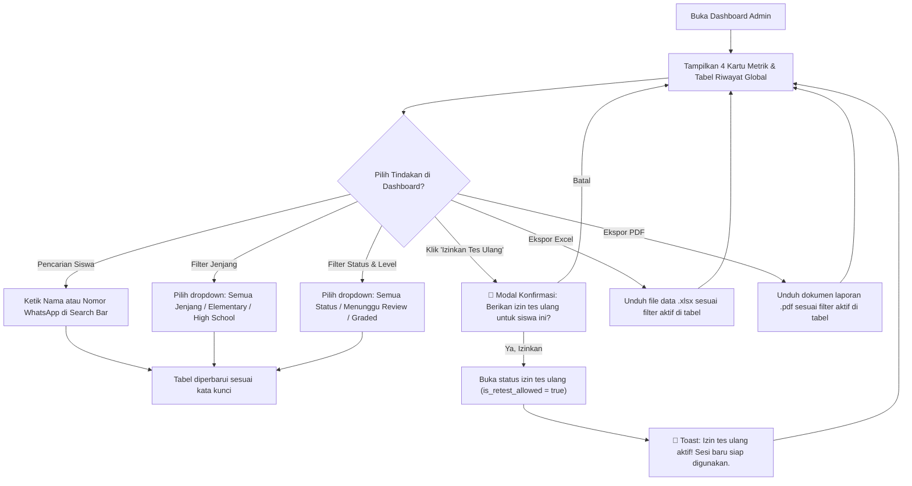

**Catatan Komponen Layar (A3 - Dashboard Admin):**
- **Navigasi Sidebar:** Menu Dashboard, Bank Soal, Pengaturan, dan Tombol Keluar.
- **4 Kartu Metrik:**
  - Total Calon Siswa Terdaftar.
  - Siswa Menunggu Evaluasi Tutor.
  - Rata-rata Skor Akurasi.
  - Rata-rata Durasi Pengerjaan.
- **Bar Toolbar & Filter:**
  - Search input: Cari Nama atau Nomor WhatsApp.
  - Dropdown Filter Jenjang: Semua Jenjang, Elementary, High School.
  - Dropdown Filter Status: Semua Status, Terdaftar, Sedang Ujian, Menunggu Review, Selesai Dinilai.
  - Tombol Aksi Utama: *"Daftarkan Siswa Baru"*, *"Ekspor Excel"*, *"Ekspor PDF"*.
- **Tabel Data Riwayat:**
  - Kolom: No, Tanggal/Waktu, Nama Lengkap, Nomor WhatsApp, Jenjang, Skor (%), Durasi Riil (Menit), Status Penilaian, Level Resmi, Tutor Penilai, dan Aksi (Izin Tes Ulang).

---

### A4. Alur Manajemen Bank Soal

**Tujuan:** Mengelola bank butir soal pilihan ganda per jenjang pendidikan dengan opsi jawaban dinamis dan validasi integritas data.

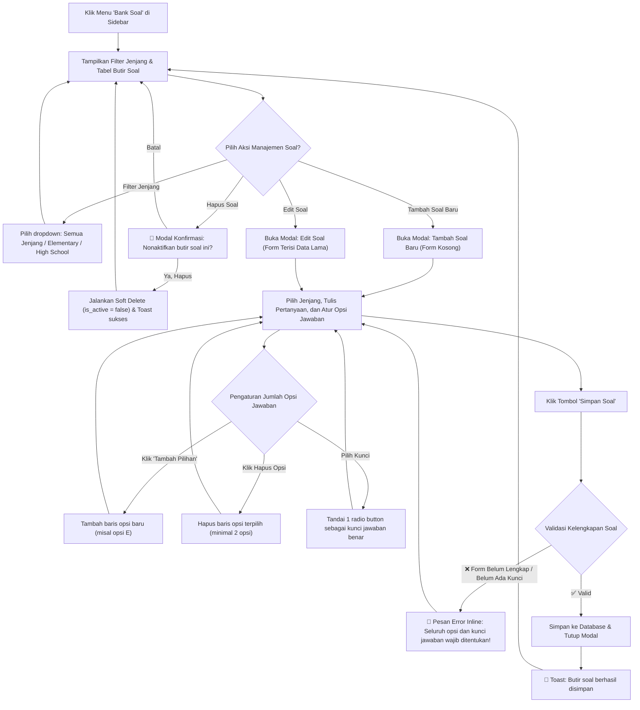

**Catatan Komponen Layar (A4 - Bank Soal):**
- **Header:** Judul *"Manajemen Bank Soal"*, dropdown filter jenjang, dan tombol *"Tambah Soal Baru"*.
- **Tabel Butir Soal:** Kolom nomor, Jenjang Pendidikan, Teks Pertanyaan, Jumlah Opsi, Kunci Jawaban, Status Keaktifan, dan Aksi (Edit, Hapus).
- **Modal Form Tambah / Edit Soal:**
  - Pilihan Jenjang: `Elementary` / `High School`.
  - Textarea: Pertanyaan Soal.
  - Daftar Opsi Dinamis: Input opsi pilihan jawaban (default A–D), tombol *"Tambah Pilihan"*, tombol hapus opsi, dan radio button kunci jawaban benar.
  - Tombol Aksi: *"Batal"* dan *"Simpan Soal"*.

---

### A5. Alur Pengaturan Kontak Tutor

**Tujuan:** Mengelola data kontak WhatsApp resmi tutor penanggung jawab jenjang untuk dihubungkan pada halaman hasil siswa.

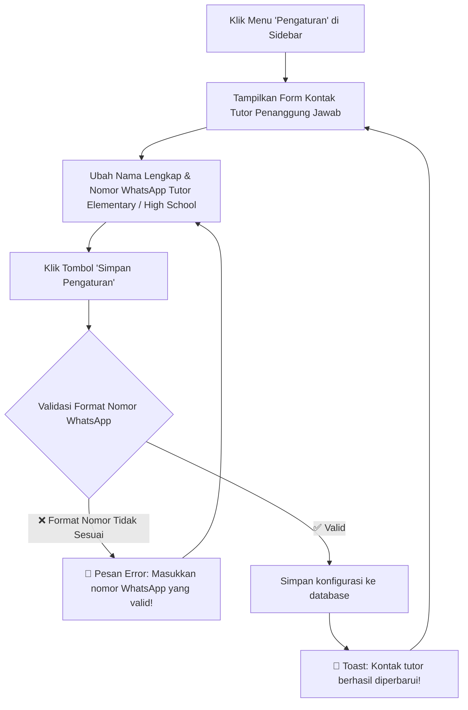

**Catatan Komponen Layar (A5 - Pengaturan):**
- **Seksi Kontak Tutor Elementary:** Input Nama Lengkap & Nomor WhatsApp Tutor Elementary.
- **Seksi Kontak Tutor High School:** Input Nama Lengkap & Nomor WhatsApp Tutor High School.
- **Tombol Aksi:** *"Simpan Pengaturan"*.

---

## C. Alur Tutor (Evaluator Akademik Jenjang)

### T1. Alur Autentikasi Tutor

**Tujuan:** Menyediakan gerbang masuk yang aman bagi akun evaluator akademik (Tutor) dengan hak akses terisolasi sesuai jenjang.

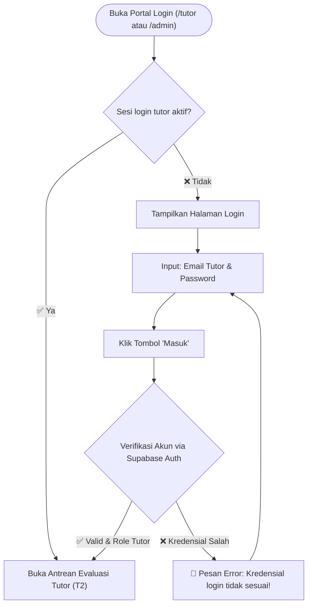

**Catatan Komponen Layar (T1 - Login Tutor):**
- Logo Up Speaking Learning Centre.
- Judul: *"Portal Evaluator Tutor"*.
- Input Field: Email dan Password.
- Tombol Aksi: *"Masuk ke Antrean Evaluasi"*.

---

### T2. Alur Antrean Evaluasi Siswa

**Tujuan:** Menampilkan daftar siswa yang telah menyelesaikan tes penempatan sesuai jenjang tugas Tutor untuk dievaluasi.

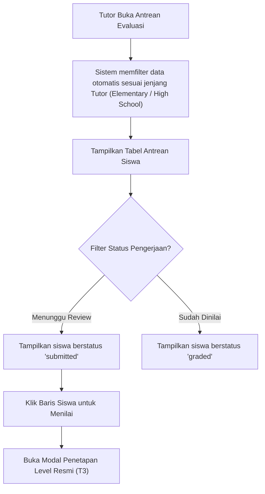

**Catatan Komponen Layar (T2 - Antrean Evaluasi):**
- **Header:** Identitas Tutor yang sedang login, label penugasan jenjang (`Tutor Elementary` atau `Tutor High School`).
- **Tab Filter Status:**
  - *"Menunggu Review"* (badge jumlah antrean aktif).
  - *"Sudah Dinilai"*.
- **Tabel Antrean Siswa:**
  - Kolom: Tanggal Tes, Nama Siswa, Nomor WhatsApp, Skor Akurasi (%), Durasi Pengerjaan Riil (Menit), Status, dan Tombol Aksi *"Evaluasi"*.

---

### T3. Alur Penetapan Level Resmi

**Tujuan:** Memberikan wewenang profesional kepada Tutor untuk menganalisis performa pengerjaan siswa dan menetapkan tingkatan level kelas resmi.

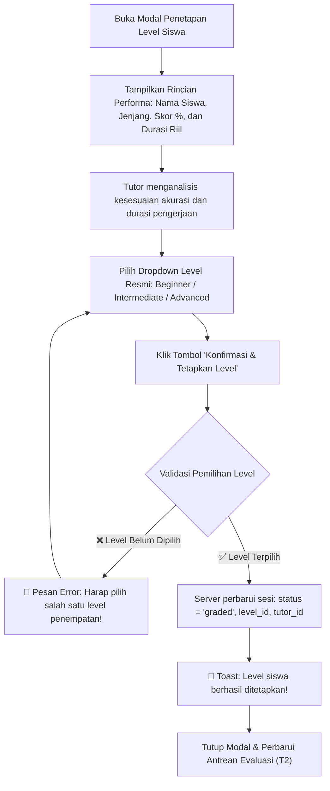

**Catatan Komponen Layar (T3 - Modal Penetapan Level):**
- **Header Modal:** Judul *"Evaluasi & Penetapan Level Siswa"*.
- **Ringkasan Data Siswa:** Nama Lengkap, Nomor WhatsApp, Jenjang Pendidikan, Tanggal Pengerjaan.
- **Metrik Performa Objektif:**
  - Skor Akurasi (% dan jumlah benar/total).
  - Durasi Pengerjaan Aktual (dalam menit).
- **Form Input Penetapan:**
  - Dropdown Pilihan Level: `Beginner`, `Intermediate`, `Advanced`.
- **Tombol Aksi:**
  - Tombol Batal: *"Tutup"*.
  - Tombol Simpan: *"Konfirmasi & Tetapkan Level"*.

---

## D. Peta Layar Lengkap (Sitemap)

Arsitektur navigasi dan keterhubungan layar antar-tiga aktor utama:

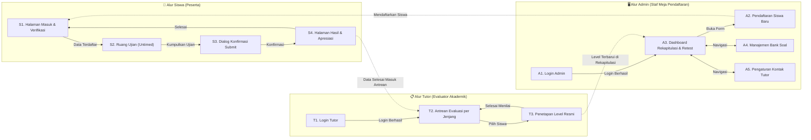

---

## E. Ringkasan Jumlah Layar

| Area | Kode | Nama Layar | Tipe Tampilan | Karakteristik Utama |
|---|---|---|---|---|
| **Siswa** | S1 | Halaman Masuk & Verifikasi | Halaman Penuh | Verifikasi Nama & No WA yang telah didaftarkan Admin |
| **Siswa** | S2 | Ruang Ujian (Exam Room) | Halaman Penuh | Soal acak Fisher-Yates per jenjang, stopwatch durasi riil, auto-save |
| **Siswa** | S3 | Dialog Konfirmasi Submit | Modal Dialog | Konfirmasi pengumpulan dan validasi kelengkapan jawaban |
| **Siswa** | S4 | Halaman Hasil & Apresiasi | Halaman Penuh | Apresiasi ramah, ringkasan skor % dan durasi riil, status menunggu tutor, kontak WA tutor |
| **Admin** | A1 | Autentikasi Admin | Halaman Penuh | Form login staf administrasi lembaga |
| **Admin** | A2 | Pendaftaran Siswa Baru | Modal Form | Pendaftaran calon siswa di meja registrasi (Nama, WA, Jenjang) |
| **Admin** | A3 | Dashboard Rekapitulasi | Halaman Penuh (Sidebar + Table) | 4 kartu metrik, pencarian, filter jenjang/status, ekspor Excel/PDF, izin tes ulang |
| **Admin** | A4 | Manajemen Bank Soal | Halaman Penuh (Sidebar + Modal) | Filter jenjang, form CRUD soal dengan opsi dinamis A–D/E, soft delete |
| **Admin** | A5 | Pengaturan Kontak Tutor | Halaman Penuh (Sidebar + Form) | Konfigurasi kontak WhatsApp resmi tutor penanggung jawab jenjang |
| **Tutor** | T1 | Autentikasi Tutor | Halaman Penuh | Form login khusus evaluator akademik tutor |
| **Tutor** | T2 | Antrean Evaluasi per Jenjang | Halaman Penuh (Sidebar + Table) | Antrean khusus jenjang tutor bersangkutan (Elementary / High School) |
| **Tutor** | T3 | Penetapan Level Resmi | Modal Form | Analisis skor % & durasi riil dan dropdown level resmi |
